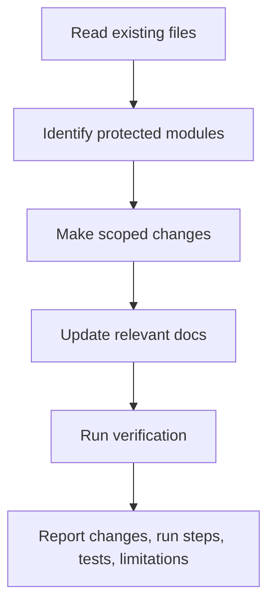

# SingFlow AI Agent Rules

<!-- 中文说明：本文档定义 Codex 后续开发必须遵守的硬规则，优先级高于临时实现偏好。 -->

This file defines mandatory rules for Codex and any AI coding agent working on SingFlow AI.

## 1. Project Identity

<!-- 中文说明：这一节说明项目身份，防止后续把 SingFlow AI 做成普通聊天框或普通点歌系统。 -->

SingFlow AI is an AI Native Karaoke & Music Workflow Studio.

It must remain a workflow product for scene playlist generation, group preference fusion, recommendation explanation, feedback memory, and Agent tool-call visualization.

It must not be reduced to:

1. A generic chat bot.
2. A simple song request list.
3. A copied clone of an existing music app.
4. A repository containing copyrighted music content.

## 2. Required Technical Direction

<!-- 中文说明：这一节定义技术栈方向，除非 owner 明确批准，不要擅自更换核心框架。 -->

Use the documented stack unless the project owner explicitly approves a change:

| Layer | Required Direction |
| --- | --- |
| Frontend | Next.js App Router, TypeScript, Tailwind CSS, shadcn/ui, Framer Motion, Recharts, TanStack Table, TanStack Query, Zustand |
| Backend | FastAPI with typed request and response models |
| Database | PostgreSQL with migrations |
| Cache / state | Redis for cache, agent state, or background coordination |
| AI workflow | Agent workflow with persisted runs and steps |
| Deployment | Docker Compose local demo |

## 3. Protected Core Modules

<!-- 中文说明：这些是项目核心模块，后续重构不能删除、绕过或弱化它们。 -->

Do not delete or bypass these modules once created:

1. Song catalog.
2. Karaoke sessions.
3. Group members.
4. Taste profiles.
5. Playlist generation.
6. Playlist items.
7. Feedback logs.
8. Agent runs.
9. Agent steps.
10. Recommendation reasons.
11. Dashboard.
12. Agent Console.

If a refactor touches any protected module, preserve its documented behavior or update the relevant docs in the same change.

## 4. Content and Copyright Rules

<!-- 中文说明：这一节是版权安全边界，禁止引入歌词、音频、MV、盗版链接、真实封面或品牌素材。 -->

The repository must not include:

1. Copyrighted song lyrics.
2. Copyrighted audio files.
3. Karaoke backing tracks.
4. Music video files or unauthorized MV links.
5. Pirated download links.
6. Copied album covers.
7. Copied brand logos, icons, or trademark assets.
8. Scraped data from music platforms without permission.

Allowed demo content:

1. Fictional song titles.
2. Fictional artist names.
3. Original generated abstract cover visuals.
4. Metadata-only mock records.
5. Licensed or public-domain metadata only when source and rights are documented.
6. MVP seed data must include at least 80 fictional songs.
7. Flagship seed data should include at least 150 fictional songs.
8. Demo song metadata must cover `en`, `zh`, `cantonese`, and `mixed`.
9. Demo song metadata must cover `ktv`, `car`, `home_party`, `warmup`, `chorus`, `nostalgic`, `high_energy`, and `late_night` scene tags.

## 5. Secret and Configuration Rules

<!-- 中文说明：这一节是密钥安全规则，任何 API Key 都只能来自环境变量或本地未提交配置。 -->

1. Never hard-code API keys.
2. Never commit `.env` files containing secrets.
3. Provide `.env.example` with placeholder values only.
4. Read `OPENAI_API_KEY` or other provider keys from environment variables.
5. Mock mode must work without any external AI key.
6. Error messages must not expose secrets or raw provider payloads.

## 6. Product Rules

<!-- 中文说明：这一节同步产品定位：Studio-first 可以有作品集级 Hero 视觉，但不能变成纯营销页。 -->

1. The first screen must be a usable Studio-first experience with optional portfolio-grade Hero Studio visuals.
2. Playlist generation must be a structured workflow, not only a chat response.
3. Every generated playlist must be traceable to an Agent Run.
4. Every generated playlist item must have at least one recommendation reason.
5. Feedback must be stored before it changes taste memory.
6. Group preference fusion must remain explainable.
7. Agent Console must show persisted data, not decorative fake steps after backend integration.
8. Dashboard metrics must be derived from stored data whenever backend exists.
9. `/showcase` or `/landing` may exist for README screenshots and portfolio demos, but they must not replace the Studio workflow.

## 7. Design Rules

<!-- 中文说明：这一节与 DESIGN_SYSTEM.md 对齐，特别强调圆角、光效和 Phase 1 截图级视觉质量。 -->

Follow `docs/DESIGN_SYSTEM.md`.

Mandatory UI constraints:

1. Use a premium dark studio visual direction.
2. Functional repeated cards must use `8px` radius or less.
3. Studio panels may use `10px` to `12px` radius.
4. Hero visual cards, music cover blocks, and showcase surfaces may use `16px` to `24px` radius.
5. Do not place cards inside cards.
6. Do not use copied brand logos or proprietary assets.
7. Do not use low-quality decorative gradient orbs or bokeh blobs unrelated to product state.
8. Low-opacity radial glow, spectrum light, and waveform backgrounds are allowed only when tied to music energy, waveform intensity, Agent state, or workflow state.
9. Use icons for tool actions where appropriate.
10. Provide hover, loading, empty, error, and disabled states for production-facing components.
11. Ensure desktop and mobile layouts have no text or component overlap.
12. Phase 1 must prioritize flagship-level frontend visual quality and interaction structure.
13. Do not make the frontend look like a generic CRUD admin dashboard.
14. Every core page must be screenshot-worthy for GitHub README or portfolio presentation.

Required Phase 1 screenshot-grade pages:

1. Studio Home.
2. AI Session Planner.
3. Playlist Timeline.
4. Group Taste Mixer.
5. Agent Console Preview.
6. Dashboard / Feedback Memory.

## 8. Documentation Rules

<!-- 中文说明：文档是项目协作契约，改行为、接口、schema、设计方向或运行方式时必须同步文档。 -->

Every code change must update at least one relevant documentation file when behavior, architecture, API, schema, setup, or UI direction changes.

Relevant docs include:

1. `README.md`
2. `docs/PRODUCT_REQUIREMENTS.md`
3. `docs/DESIGN_SYSTEM.md`
4. `docs/TECH_ARCHITECTURE.md`
5. `docs/DATABASE_SCHEMA.md`
6. `docs/API_SPEC.md`
7. `docs/ROADMAP.md`
8. `AGENTS.md`

If a change is purely mechanical and does not affect behavior, explicitly say that no docs update was needed.

## 9. Development Completion Rules

<!-- 中文说明：每次开发完成都要交代改了什么、怎么运行、怎么验证，不能只给模糊总结。 -->

Every completed development task must report:

1. What changed.
2. Which files changed.
3. How to run the project.
4. How to test or verify the change.
5. Any known limitations or follow-up work.

Do not finish a task with only a vague summary.

## 10. Required Development Flow

<!-- 中文说明：这一节规定 Codex 的基本工作流：先读现状，再小范围修改，再验证和汇报。 -->

Codex must follow this flow for implementation tasks:

Executable rules:

1. Read before editing.
2. Keep changes scoped to the requested task.
3. Preserve protected modules.
4. Update docs or state why no docs update was needed.
5. Run relevant verification before final response when possible.

## 11. Testing Rules

<!-- 中文说明：测试强度随风险提升，文档修改至少要确认文件存在和 Markdown 可读。 -->

Testing expectations scale with risk:

| Change Type | Minimum Verification |
| --- | --- |
| Documentation only | Confirm files exist and Markdown is readable |
| Frontend UI | Build or lint plus screenshot/manual viewport check when possible |
| Backend API | Unit or integration tests plus OpenAPI check |
| Database schema | Migration up/down or schema creation check |
| Agent workflow | Test mock mode and failure fallback |
| Docker | `docker compose up` or documented equivalent |

If tests cannot be run, explain why and provide the exact command that should be run later.

## 12. Database Rules

<!-- 中文说明：数据库规则必须与 DATABASE_SCHEMA.md 对齐，尤其是 feedback_logs 不可变和版权安全字段。 -->

1. Schema must stay aligned with `docs/DATABASE_SCHEMA.md`.
2. Use migrations for schema changes.
3. Do not store lyrics, audio URLs, MV URLs, or unauthorized cover art.
4. Do not mutate `feedback_logs` as normal business flow.
5. Use foreign keys for core relationships.
6. Add indexes for dashboard and lookup paths when new query patterns are introduced.

## 13. API Rules

<!-- 中文说明：API 规则必须与 API_SPEC.md 对齐，公开会话接口统一使用 `/karaoke-sessions`。 -->

1. API routes must stay aligned with `docs/API_SPEC.md`.
2. Public endpoints must use typed request and response models.
3. Errors must use a structured error envelope.
4. Unsafe content must be rejected.
5. Mock mode must be supported for AI-dependent endpoints.
6. Do not leak stack traces or secrets in API responses.
7. Public karaoke session APIs must use `/karaoke-sessions`; do not introduce a shorter session API alias.

## 14. Agent Workflow Rules

<!-- 中文说明：Agent 工作流必须持久化为 runs 和 steps，不能只在 UI 里伪造过程。 -->

1. Persist `agent_runs` for AI workflows.
2. Persist ordered `agent_steps` for tool calls and major reasoning phases.
3. Tools must be narrow, typed, and auditable.
4. Do not expose raw chain-of-thought.
5. Store sanitized input and output summaries only.
6. Every recommendation reason must be original text and must not quote lyrics.
7. Failed tool calls must be visible in Agent Console with safe error messages.

## 15. Git and File Safety Rules

<!-- 中文说明：这一节规定仓库边界和文件安全，Codex 不得修改仓库外文件或无关用户文件。 -->

1. Do not delete core modules without explicit approval.
2. Do not revert user changes unless explicitly asked.
3. Do not run destructive Git commands such as `git reset --hard` without explicit approval.
4. Keep changes scoped to the requested task.
5. Do not introduce unrelated refactors while implementing a phase task.
6. Do not create large binary assets unless they are explicitly required and copyright-safe.
7. All work must stay inside the SingFlow AI repository root.
8. Do not modify files outside this repository.
9. Do not move, delete, or rename unrelated user files.

## 16. Definition of Done

<!-- 中文说明：这一节定义任务完成标准，只有实现、文档、验证和安全边界都满足才算完成。 -->

A task is done only when:

1. Implementation matches the requested phase or issue.
2. Relevant docs are updated or a no-docs-needed reason is stated.
3. Verification has been run or a clear reason is provided.
4. No secrets or copyrighted music content were added.
5. The final response includes run and test instructions.
