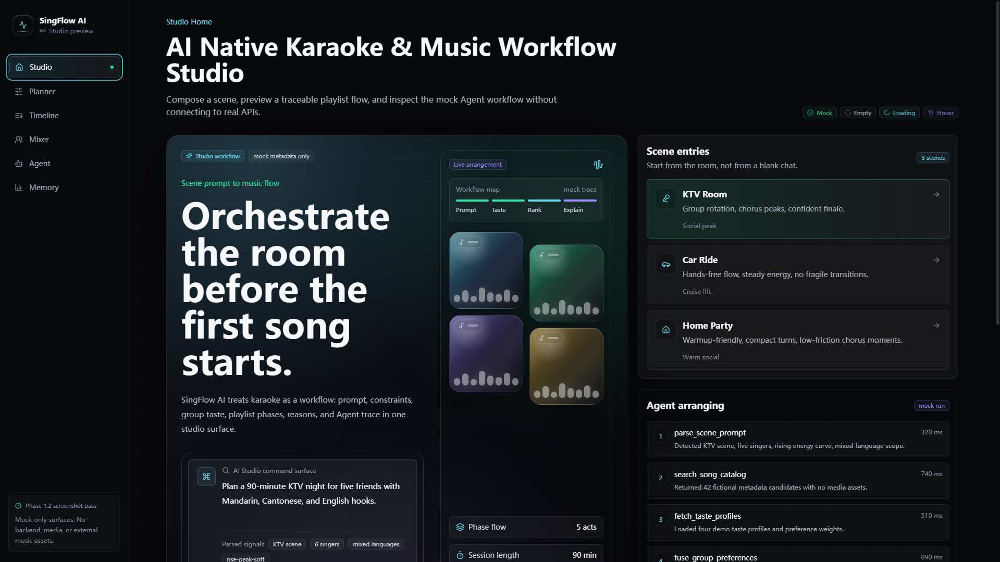
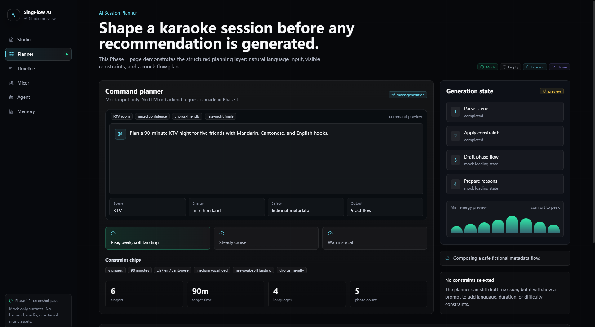
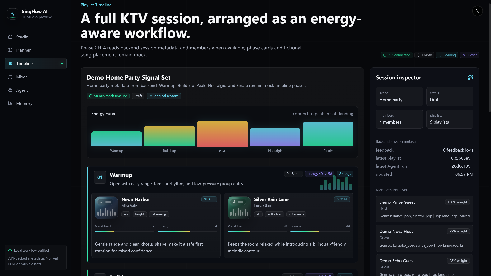
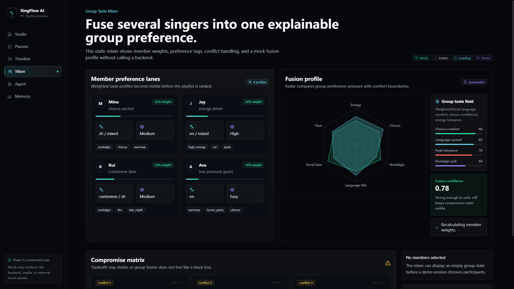
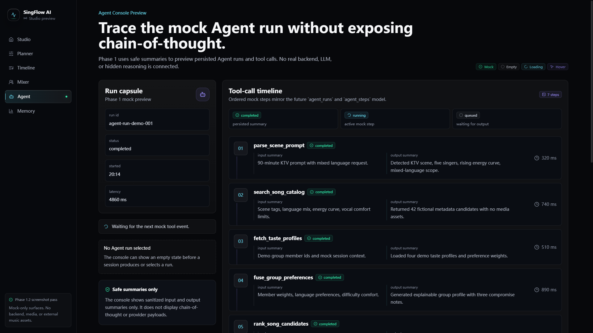
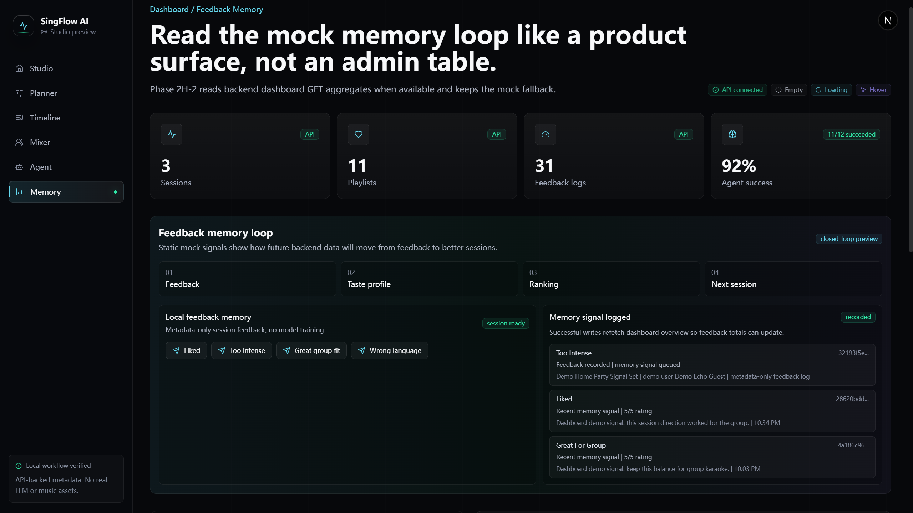
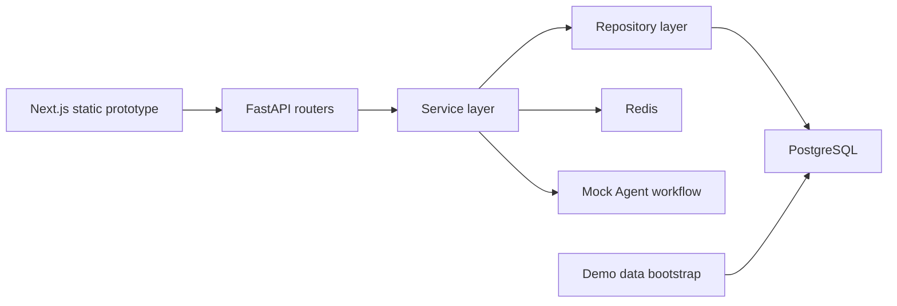

# SingFlow AI

**AI Native Karaoke & Music Workflow Studio**

SingFlow AI is a full-stack portfolio project for AI music scene orchestration: natural-language scene planning, group taste fusion, playlist workflow generation, recommendation reasons, feedback memory, and Agent workflow observability.

It is not a generic chatbot and not a simple karaoke song picker. The product is designed as an explainable workflow studio for KTV, in-car entertainment, home music devices, and group music scenarios.

## 中文简介

SingFlow AI 是一个 AI Native K 歌与音乐场景工作流平台原型，面向 KTV、车载娱乐、家庭音乐设备和多人聚会音乐场景。项目展示从自然语言场景输入，到多人偏好融合、歌单工作流、推荐理由、反馈记忆和 Agent 工具调用可视化的完整产品思路。

当前已完成前端旗舰静态原型、FastAPI 后端基础、PostgreSQL 数据模型、API routers、repositories/services 分层，以及 96 首虚构歌曲的 Demo Data Bootstrap。Phase 2G 已在本机 Docker 环境完成后端 runtime verification：PostgreSQL / Redis / API container、Alembic migration、demo bootstrap 和 API smoke flow 均已通过。

## Current Status

| Area | Status |
| --- | --- |
| Frontend static prototype | Completed |
| Backend API/data foundation | Completed |
| Demo data bootstrap | Completed |
| Runtime verification guide | Completed |
| Docker/Postgres/API smoke verification | Passed locally in Phase 2G |
| Dashboard partial API integration | Completed in Phase 2H-2 with mock fallback |
| Agent Console partial API integration | Completed in Phase 2H-3 with mock fallback |
| Real LLM provider | Not connected |
| Real music catalog / streaming | Not included |

See [Backend Runtime Verification](docs/BACKEND_RUNTIME_VERIFICATION.md) for the verified local Docker checklist and Phase 2G result summary.

## Screenshots



The Studio Home frames SingFlow AI as a command-center experience for scene planning, group taste fusion, playlist workflow, and Agent observability.

| Planner | Timeline |
| --- | --- |
| <br><sub>Plan a karaoke or music scene from natural-language intent.</sub> | <br><sub>Review playlist order, energy flow, and recommendation context.</sub> |

| Group Taste Mixer | Agent Console |
| --- | --- |
| <br><sub>Compare multi-person preferences and explainable group trade-offs.</sub> | <br><sub>Inspect mock Agent runs, tool steps, and safe workflow summaries.</sub> |

| Dashboard |
| --- |
| <br><sub>Track demo sessions, feedback patterns, and backend workflow health.</sub> |

Capture guidance lives in [Screenshot Guide](docs/SCREENSHOT_GUIDE.md).

## Why This Project Matters

SingFlow AI demonstrates a product-grade AI workflow rather than a thin prompt wrapper:

- Natural-language scene planning for KTV, car, and home party contexts.
- Multi-person taste fusion with explainable group trade-offs.
- Playlist timeline with ordered items, energy progression, and recommendation reasons.
- Feedback memory foundation built on immutable feedback logs.
- Agent Run and Agent Step records for workflow observability.
- Dashboard surfaces for sessions, feedback, and Agent health.
- FastAPI/PostgreSQL backend with typed schemas, repositories, services, routers, and migrations.
- Deterministic mock-only demo data bootstrap with copyright-safe fictional metadata.

## Feature Highlights

| Feature | Current Scope |
| --- | --- |
| Scene prompt studio | Frontend static prototype with polished command-style surfaces |
| Group taste mixer | Frontend visualization plus backend taste-fusion foundation |
| Playlist workflow | Backend mock persistence and frontend timeline prototype |
| Recommendation reasons | Persisted reason model and demo-safe reason text |
| Feedback memory foundation | Feedback log API and memory update status foundation |
| Agent console | Persisted Agent Runs and Agent Steps plus partial frontend GET integration |
| Dashboard insights | Database-backed aggregate helpers and frontend dashboard prototype |
| Demo bootstrap | 96 fictional songs, users, sessions, playlists, feedback logs, Agent Runs, and Agent Steps |

## Tech Stack

| Layer | Technology |
| --- | --- |
| Frontend | Next.js App Router, React, TypeScript |
| UI | Tailwind CSS, shadcn/ui-inspired components, Framer Motion |
| Data visualization | Recharts |
| State | Zustand |
| Backend | FastAPI, Pydantic, SQLAlchemy |
| Database | PostgreSQL, Alembic migrations |
| Cache / coordination | Redis |
| Architecture | Routers, services, repositories, schemas, demo bootstrap |
| Data | Fictional metadata-only demo catalog |
| DevOps | Docker Compose verification guide, GitHub Actions CI |

## Architecture Overview



Most frontend pages remain mock-first. Dashboard and Agent Console now have partial GET API integration with mock fallback, and the broader Studio workflow still needs future frontend-backend integration passes.

Core backend flow:

```text
FastAPI routes -> Pydantic schemas -> services -> repositories -> SQLAlchemy models -> PostgreSQL
```

## Project Structure

```text
singflow-ai/
  apps/
    web/                 # Next.js App Router frontend prototype
    api/                 # FastAPI backend
  docs/                  # Product, architecture, API, data, verification, roadmap
  packages/              # Future shared packages
  docker-compose.yml     # Local demo services
  README.md
```

Important backend modules:

```text
apps/api/app/
  api/routes/            # health, songs, users, karaoke_sessions, playlists, feedback, agent_runs, dashboard
  schemas/               # typed request/response models
  repositories/          # SQLAlchemy data access
  services/              # deterministic mock-only business coordination
  db/models.py           # Phase 2 core SQLAlchemy models
  data/                  # fictional demo metadata
  scripts/               # demo bootstrap script
```

## Quick Start

### Frontend Preview

```bash
npm install
npm run dev:web
```

Open:

```text
http://localhost:3000
```

Current prototype routes:

- `/`
- `/planner`
- `/timeline`
- `/sessions/demo`
- `/mixer`
- `/agent-runs/demo`
- `/dashboard`

### Backend Local Setup

From the repository root:

```bash
python -m venv .venv
.venv\Scripts\activate
pip install -r apps/api/requirements.txt
npm run dev:api
```

On macOS/Linux:

```bash
source .venv/bin/activate
```

Backend URLs:

```text
http://localhost:8000/health
http://localhost:8000/api/v1/health
http://localhost:8000/docs
```

Health routes can run with the local API process. Database-backed business routes require PostgreSQL, Alembic migration, and demo bootstrap. Phase 2G verified those backend routes in local Docker; most frontend pages remain mock-first, while the Dashboard and Agent Console can partially read backend GET data with mock fallback.

### Demo Data Dry Run

The dry run validates demo metadata without connecting to or writing a database:

```bash
cd apps/api
python -m app.scripts.bootstrap_demo_data --dry-run
```

It checks the 96-song fictional catalog, language coverage, scene tags, forbidden content keys, and planned demo graph.

### Docker Runtime Verification Checklist

Backend Docker runtime verification passed locally in Phase 2G.

The verified backend scope includes Docker Compose config, PostgreSQL, Redis, the FastAPI API container, Alembic migration, demo bootstrap dry-run and normal mode, health checks, core API smoke checks, and the dynamic mock playlist/feedback/dashboard flow:

- [Backend Runtime Verification](docs/BACKEND_RUNTIME_VERIFICATION.md)

This is local Docker verification, not a cloud release. Dashboard and Agent Console partial GET integration are available with mock fallback; the broader frontend workflow still needs future integration passes.

## API Overview

Public API base:

```text
/api/v1
```

Current router groups:

| Area | Endpoints |
| --- | --- |
| Health | `/health`, `/api/v1/health` |
| Songs | `/songs`, `/songs/{song_id}`, `/songs/import` |
| Demo users | `/demo-users`, `/users/{user_id}/taste-profiles`, `/users/{user_id}/feedback-summary` |
| Karaoke sessions | `/karaoke-sessions`, `/karaoke-sessions/{session_id}`, members, taste fusion |
| Playlists | `/playlists/generate`, `/playlists/{playlist_id}` |
| Feedback | `/feedback`, `/karaoke-sessions/{session_id}/feedback` |
| Agent Runs | `/agent-runs`, `/agent-runs/{agent_run_id}`, `/agent-runs/{agent_run_id}/steps` |
| Dashboard | `/dashboard/overview`, `/dashboard/taste-evolution`, `/dashboard/agent-runs`, `/dashboard/agent-performance` |

See:

- [API Spec](docs/API_SPEC.md)
- [API Demo Flow](docs/API_DEMO_FLOW.md)

## Demo Data

Phase 2D adds deterministic, copyright-safe demo metadata:

- 96 fictional songs
- 6 demo users
- 12 taste profiles
- 3 karaoke sessions
- 11 group members
- 2 generated playlists
- 15 playlist items
- 15 recommendation reasons
- 13 feedback logs
- 3 Agent Runs, including 1 failed mock run for dashboard inspection
- 17 Agent Steps with sanitized summaries only

The data is metadata-only. It does not include lyrics, audio, MV links, real album covers, external platform links, copied brand assets, or scraped music-platform data.

See [Demo Data](docs/DEMO_DATA.md).

## Safety And Copyright Boundary

SingFlow AI is designed to be portfolio-safe:

- No real songs in seed data.
- No lyrics.
- No audio files.
- No karaoke backing tracks.
- No MV files or unauthorized MV links.
- No real album covers.
- No pirate links.
- No copied brand assets.
- No external music scraping.
- `LLM_PROVIDER=mock` remains the current default.

Future real catalog or LLM integration must be explicitly approved and rights-safe.

## Roadmap

### Completed

- Phase 0: monorepo foundation, docs, Docker Compose skeleton, CI.
- Phase 1 / 1.1 / 1.2: screenshot-grade frontend static prototype.
- Phase 2A: database models, Alembic migration, Pydantic schemas.
- Phase 2B: repositories, services, core helpers.
- Phase 2C-1 / 2C-2: FastAPI routers and API wiring.
- Phase 2D: demo data bootstrap.
- Phase 2E: backend runtime verification guide.
- Phase 2F: GitHub portfolio packaging documentation.
- Phase 2G: backend Docker runtime verification passed locally.
- Phase 2H-1: frontend GET-only API client foundation.
- Phase 2H-2: Dashboard partial API integration for backend overview and Agent run aggregates with mock fallback.
- Phase 2H-3: Agent Console partial API integration for persisted Agent Run and Agent Step GET data with mock fallback.

### Next Phases

- Phase 2H-4 Sessions / Timeline API integration.
- Runtime integration verification for the partial frontend API slices.
- Real deployment documentation and environment hardening.
- Optional rights-safe LLM adapter in a later phase.
- Optional real music provider integration only if metadata rights are documented and approved.
- Optional demo video or GIF after manual capture.

See [Roadmap](docs/ROADMAP.md).

## Documentation

| Doc | Purpose |
| --- | --- |
| [Product Requirements](docs/PRODUCT_REQUIREMENTS.md) | Product scope and non-goals |
| [Design System](docs/DESIGN_SYSTEM.md) | Visual and interaction rules |
| [Technical Architecture](docs/TECH_ARCHITECTURE.md) | Full-stack architecture and agent workflow |
| [Database Schema](docs/DATABASE_SCHEMA.md) | PostgreSQL table contracts |
| [API Spec](docs/API_SPEC.md) | Public API contracts |
| [Demo Data](docs/DEMO_DATA.md) | Fictional metadata bootstrap |
| [Backend Runtime Verification](docs/BACKEND_RUNTIME_VERIFICATION.md) | Docker/Alembic/bootstrap/API smoke checklist |
| [Screenshot Guide](docs/SCREENSHOT_GUIDE.md) | Manual screenshot capture plan |
| [API Demo Flow](docs/API_DEMO_FLOW.md) | Mock/database-backed API walkthrough |
| [中文项目简介](docs/PROJECT_BRIEF_CN.md) | Chinese project brief for interviews |
| [Roadmap](docs/ROADMAP.md) | Phase plan and next work |

## Local Verification Notes

- Current local Node.js has previously been below the project target of Node.js 22+.
- Current local Python has previously been Anaconda Python 3.9, while the project target is Python 3.12+.
- Pytest commands have hung in the current Windows/PowerShell/Anaconda shell and should not be run there.
- Phase 2G backend runtime verification passed in local Docker, with `LLM_PROVIDER=mock`.

Commands intentionally not run in the current unstable shell:

```bash
pytest
python -m pytest
pytest --version
python -m pytest --version
```

## License

MIT License.
