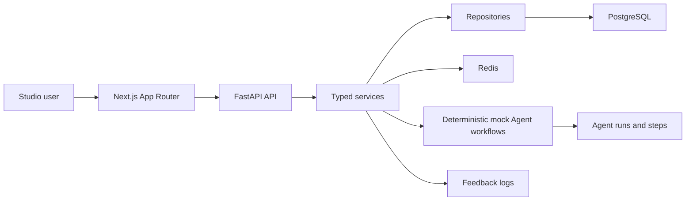

# SingFlow AI

**AI Native Karaoke & Music Workflow Studio**

Local deterministic workflows, explainable Agent traces, group taste fusion, and metadata-only feedback memory for karaoke and music scene planning.

SingFlow AI is a full-stack portfolio project built with Next.js, FastAPI, PostgreSQL, and Redis. It demonstrates how an AI-native music workflow product can be structured around scene planning, persisted Agent runs, group preference fusion, recommendation explanations, and feedback memory without connecting live LLM providers or real music assets.

It is not a generic chatbot and not a simple song request list. The current project is a local mock/database-backed workflow studio designed for portfolio review, code walkthroughs, and interviews.

## What It Demonstrates

| Area | Demonstration |
| --- | --- |
| Full-stack product architecture | Next.js App Router frontend, FastAPI API, PostgreSQL persistence, Redis runtime service, Docker Compose local stack |
| Planner workflow | Controlled deterministic mock playlist generation with safe fallback |
| Agent observability | Persisted Agent runs and ordered Agent steps with safe summaries |
| Timeline / Sessions | Backend session metadata and members with mock-safe phase and song-card previews |
| Group taste fusion | Controlled deterministic mock taste-fusion preview using backend session members |
| Feedback memory | Controlled metadata-only feedback write/read loop on Dashboard |
| Runtime resilience | Backend-online connected states and backend-offline mock fallback smoke checks |
| Safety boundary | Fictional metadata only; no lyrics, audio, MV files, real covers, brand assets, or pirate links |

## Feature Highlights

| Surface | Current Scope |
| --- | --- |
| AI Session Planner | Lets the user shape a scene prompt and call `POST /api/v1/playlists/generate` with `mode=mock`; successful results show playlist preview, Agent status, track rows, and safe reasons |
| Agent Console | Reads persisted Agent run detail and Agent steps; shows run capsule, tool-call timeline, inspection matrix, and safe summaries only |
| Playlist Timeline / Sessions | Reads backend karaoke session metadata and members; keeps phase cards, fictional song cards, energy curve, and fit reasons as mock-safe visual previews |
| Group Taste Mixer | Reads backend session members and calls controlled `POST /api/v1/karaoke-sessions/{session_id}/taste-fusion`; shows language, genre, energy, conflict, and contribution summaries |
| Dashboard / Feedback Memory | Reads dashboard aggregates, submits controlled metadata-only feedback through `POST /api/v1/feedback`, refetches overview, and reads recent session feedback |
| Mock Fallback | Key pages remain usable when the backend is unavailable; no blank page or raw stack trace is expected |

## Architecture Overview



| Layer | Stack |
| --- | --- |
| Frontend | Next.js App Router, React, TypeScript, Tailwind CSS, Framer Motion, Recharts, TanStack Query, Zustand |
| API | FastAPI, Pydantic typed request/response models |
| Data | PostgreSQL, SQLAlchemy repositories, Alembic migrations |
| Runtime service | Redis for local stack readiness and future workflow coordination |
| Workflows | Deterministic mock playlist generation, taste fusion, feedback memory logging, Agent run persistence |
| Safety | Metadata-only fictional catalog and sanitized Agent summaries |

## End-to-End Local Workflow

The verified local loop is:

1. Planner generates a deterministic mock playlist.
2. The generated playlist is persisted and can be read back.
3. The generation creates a persisted Agent run and ordered Agent steps.
4. Agent Console displays safe persisted run and step summaries.
5. Timeline and Sessions display backend session metadata and members while keeping phase/song cards mock-safe.
6. Mixer runs deterministic mock taste fusion from backend session members.
7. Dashboard records a metadata-only feedback signal.
8. Dashboard overview and recent memory signal reflect feedback read-after-write.

## Screenshots

Screenshots below reflect the Phase 4B refreshed local mock-only workflow, including API-backed metadata where available and no real LLM or music assets.


| Planner | Timeline |
| --- | --- |
| <br><sub>Scene planning, constraints, and mock generation preview.</sub> | <br><sub>Session metadata with mock-safe phase and fictional song previews.</sub> |

| Group Taste Mixer | Agent Console |
| --- | --- |
| <br><sub>Multi-person preference fusion and explainable group trade-offs.</sub> | <br><sub>Persisted Agent run and step observability with safe summaries.</sub> |

| Dashboard |
| --- |
| <br><sub>Backend aggregates, feedback distribution, and metadata-only memory loop.</sub> |

Capture guidance lives in [Screenshot Guide](docs/SCREENSHOT_GUIDE.md).

## Quick Start

Install dependencies:

```bash
npm install
```

Start the local backend services:

```bash
docker compose up -d postgres redis api
```

Start the frontend:

```bash
npm run dev:web
```

Open the studio:

```text
http://localhost:3000
```

Useful routes:

| Route | Surface |
| --- | --- |
| `/` | Studio Home |
| `/planner` | AI Session Planner |
| `/agent-runs/demo` | Agent Console |
| `/timeline` | Playlist Timeline |
| `/sessions/demo` | Sessions demo view |
| `/mixer` | Group Taste Mixer |
| `/dashboard` | Dashboard / Feedback Memory |

Backend health and API docs:

```text
http://localhost:8000/health
http://localhost:8000/api/v1/health
http://localhost:8000/docs
```

The backend local stack expects `LLM_PROVIDER=mock`. The browser can call controlled local `GET`, `POST`, and `OPTIONS` routes from `http://localhost:3000` and `http://127.0.0.1:3000`; this does not add a generic write client.

## Runtime Verification Summary

| Verification | Result |
| --- | --- |
| Phase 2G backend runtime | Docker/PostgreSQL/Redis/API, Alembic migration, demo bootstrap, and API smoke checks passed locally |
| Phase 2H frontend GET integrations | Dashboard, Agent Console, Timeline, and Sessions partial GET integrations verified with mock fallback |
| Phase 3A Planner workflow | Controlled mock playlist generation verified through backend direct POST and browser check |
| Phase 3B Mixer workflow | Controlled mock taste fusion verified through backend direct POST and browser check |
| Phase 3C Feedback Memory | Controlled metadata-only feedback write/read verified through backend direct POST and browser check |
| Phase 3D E2E workflow | Local backend E2E checks, frontend route smoke, and fallback route smoke passed |

See [Frontend Backend Runtime Verification](docs/FRONTEND_BACKEND_RUNTIME_VERIFICATION.md) and [Backend Runtime Verification](docs/BACKEND_RUNTIME_VERIFICATION.md).

## API Overview

Public API base:

```text
/api/v1
```

| Area | Endpoints |
| --- | --- |
| Health | `/health`, `/api/v1/health` |
| Songs | `/songs`, `/songs/{song_id}`, `/songs/import` |
| Demo users | `/demo-users`, `/users/{user_id}/taste-profiles`, `/users/{user_id}/feedback-summary` |
| Karaoke sessions | `/karaoke-sessions`, `/karaoke-sessions/{session_id}`, members, taste fusion |
| Playlists | `/playlists/generate`, `/playlists/{playlist_id}` |
| Feedback | `/feedback`, `/karaoke-sessions/{session_id}/feedback` |
| Agent Runs | `/agent-runs`, `/agent-runs/{agent_run_id}`, `/agent-runs/{agent_run_id}/steps` |
| Dashboard | `/dashboard/overview`, `/dashboard/taste-evolution`, `/dashboard/agent-runs`, `/dashboard/agent-performance` |

See [API Spec](docs/API_SPEC.md) and [API Demo Flow](docs/API_DEMO_FLOW.md).

## Demo Data

The local demo seed is deterministic and copyright-safe:

- 96 fictional songs
- 6 demo users
- 12 taste profiles
- 3 karaoke sessions
- 11 group members
- 2 generated playlists
- 15 playlist items
- 15 recommendation reasons
- 13 feedback logs at seed time
- 3 Agent runs and 17 Agent steps at seed time

Runtime verification may add additional generated playlists, Agent runs, Agent steps, and feedback logs in the local database volume.

The dataset is metadata-only. It does not include lyrics, audio, MV links, real album covers, copied brand assets, external music platform links, or scraped platform data.

## Safety And Copyright Boundary

SingFlow AI is intentionally portfolio-safe:

- No live LLM provider is connected.
- No real music catalog is integrated.
- No real song lyrics are stored or displayed.
- No audio files, karaoke tracks, MV files, real covers, copied brand assets, or pirate links are included.
- Agent Console shows sanitized summaries only, not hidden reasoning.
- Feedback memory is a metadata-only log, not model training.
- `LLM_PROVIDER=mock` is the verified local runtime mode.

## Known Limitations

- Studio Home remains mock-first by design.
- Timeline phase cards and fictional song cards remain mock-safe visual previews and are not yet driven by generated runtime placement.
- Mixer taste fusion is a preview workflow and is not persisted as an Agent workflow.
- Feedback memory records metadata-only signals and does not train a real model.
- The project is a local portfolio demo, not a hosted service or production service.
- Hydrated browser click checks were manually confirmed for key Planner, Mixer, and Dashboard flows; Phase 3D did not automate browser clicks.

## Future Work

These items are not implemented:

- Optional DeepSeek or other LLM provider adapter behind an explicit mock/real provider boundary.
- Optional generated playlist to Timeline runtime linkage.
- Optional persisted taste-fusion artifact and Agent workflow trace.
- Optional hosted demo packaging and environment hardening.
- Optional demo video or GIF for walkthroughs.

## Documentation Map

| Doc | Purpose |
| --- | --- |
| [Roadmap](docs/ROADMAP.md) | Phase status and future work |
| [API Demo Flow](docs/API_DEMO_FLOW.md) | Mock/database-backed API walkthrough |
| [Frontend Backend Runtime Verification](docs/FRONTEND_BACKEND_RUNTIME_VERIFICATION.md) | Local runtime verification record |
| [Product Requirements](docs/PRODUCT_REQUIREMENTS.md) | Product scope, non-goals, and safety boundary |
| [Screenshot Guide](docs/SCREENSHOT_GUIDE.md) | Screenshot capture guidance and refreshed portfolio set |
| [Technical Architecture](docs/TECH_ARCHITECTURE.md) | Backend/frontend architecture notes |
| [Database Schema](docs/DATABASE_SCHEMA.md) | PostgreSQL table contracts |
| [API Spec](docs/API_SPEC.md) | Public API contracts |

## License

MIT License.
