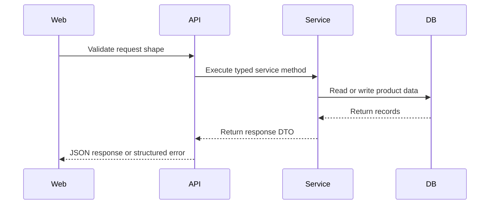

# SingFlow AI API Spec

<!-- 中文说明：本文档是前后端契约源头，所有公开 API 路径、请求结构、响应结构和错误格式都应与实现保持一致。 -->

## 1. API Overview

<!-- 中文说明：公开 API 统一挂在 `/api/v1` 下，Karaoke Session 相关接口必须使用 `/karaoke-sessions`。 -->

Base URL:

```text
/api/v1
```

Local development examples:

| Service | URL |
| --- | --- |
| Web | `http://localhost:3000` |
| API | `http://localhost:8000/api/v1` |
| OpenAPI | `http://localhost:8000/docs` |

Authentication can be demo-light for MVP. If auth is added later, use `Authorization: Bearer <token>` and never hard-code credentials in frontend or backend code.

## 2. Common Response Rules

<!-- 中文说明：这一节定义统一响应和错误规范，避免前端为不同接口写不一致的处理逻辑。 -->

### Request Flow



Executable rules:

1. Route handlers validate and delegate; business logic belongs in services.
2. Services return typed DTOs that match this spec.
3. Database errors must become structured API errors.
4. API responses must not include secrets, lyrics, raw provider payloads, or stack traces.

### Success Envelope

Use direct JSON objects for single-resource endpoints and arrays only when the endpoint is clearly a list endpoint.

Example:

```json
{
  "id": "2a1c4b52-7ef5-4d6d-9cf4-000000000001",
  "title": "Late Night KTV Warmup"
}
```

### Error Envelope

All errors should use this shape:

```json
{
  "error": {
    "code": "VALIDATION_ERROR",
    "message": "target_length must be between 3 and 30.",
    "details": {
      "field": "target_length"
    }
  }
}
```

### Common Error Codes

| Code | HTTP | Meaning |
| --- | --- | --- |
| `VALIDATION_ERROR` | `400` | Request shape or value is invalid |
| `NOT_FOUND` | `404` | Resource does not exist |
| `CONFLICT` | `409` | Request conflicts with current state |
| `AGENT_RUN_FAILED` | `500` | Agent workflow failed after fallback |
| `LLM_PROVIDER_UNAVAILABLE` | `503` | Non-mock model provider is unavailable |
| `UNSAFE_CONTENT_BLOCKED` | `422` | Request attempts to use blocked content |

## 3. Shared Types

<!-- 中文说明：共享类型用于保证接口示例、数据库字段和前端 TypeScript 类型一致。 -->

### Song

```json
{
  "id": "00000000-0000-4000-8000-000000000001",
  "title": "Neon Harbor",
  "artist_name": "Studio Echo",
  "language": "en",
  "genres": ["synth_pop", "karaoke_pop"],
  "moods": ["bright", "night_drive"],
  "scene_tags": ["ktv", "warmup", "late_night"],
  "energy": 0.72,
  "vocal_difficulty": 0.38,
  "bpm": 116,
  "duration_seconds": 214,
  "rights_status": "demo_safe"
}
```

### Playlist Item

```json
{
  "id": "00000000-0000-4000-8000-000000000101",
  "position": 1,
  "fit_score": 0.87,
  "song": {
    "id": "00000000-0000-4000-8000-000000000001",
    "title": "Neon Harbor",
    "artist_name": "Studio Echo"
  },
  "score_breakdown": {
    "scene_fit": 0.91,
    "group_taste_fit": 0.82,
    "energy_curve_fit": 0.88
  },
  "reasons": [
    {
      "reason_type": "scene_fit",
      "short_reason": "A bright, easy-opening track that fits the warm-up energy curve.",
      "confidence": 0.86
    }
  ]
}
```

## 4. Song Catalog API

<!-- 中文说明：歌曲接口只处理版权安全的元数据，不允许导入歌词、音频、MV 或真实专辑封面。 -->

### `GET /songs`

Searches and filters the song catalog.

Query parameters:

| Parameter | Type | Required | Description |
| --- | --- | --- | --- |
| `q` | `string` | No | Text search across title and artist |
| `language` | `string` | No | `en`, `zh`, `cantonese`, `mixed` |
| `genre` | `string` | No | Genre tag |
| `mood` | `string` | No | Mood tag |
| `scene_tag` | `string` | No | Scene tag such as `ktv`, `car`, `home_party`, `warmup`, `chorus`, `nostalgic`, `high_energy`, `late_night` |
| `energy_min` | `number` | No | Minimum energy |
| `energy_max` | `number` | No | Maximum energy |
| `vocal_difficulty_max` | `number` | No | Difficulty ceiling |
| `limit` | `integer` | No | Default `20`, max `100` |
| `offset` | `integer` | No | Default `0` |

Response:

```json
{
  "items": [
    {
      "id": "00000000-0000-4000-8000-000000000001",
      "title": "Neon Harbor",
      "artist_name": "Studio Echo",
      "language": "en",
      "genres": ["synth_pop", "karaoke_pop"],
      "moods": ["bright", "night_drive"],
      "scene_tags": ["ktv", "warmup", "late_night"],
      "energy": 0.72,
      "vocal_difficulty": 0.38,
      "rights_status": "demo_safe"
    }
  ],
  "total": 1,
  "limit": 20,
  "offset": 0
}
```

Errors:

| HTTP | Code | Case |
| --- | --- | --- |
| `400` | `VALIDATION_ERROR` | Invalid numeric range |

### `GET /songs/{song_id}`

Returns one song metadata record.

Response:

```json
{
  "id": "00000000-0000-4000-8000-000000000001",
  "title": "Neon Harbor",
  "artist_name": "Studio Echo",
  "language": "en",
  "genres": ["synth_pop", "karaoke_pop"],
  "moods": ["bright", "night_drive"],
  "scene_tags": ["ktv", "warmup", "late_night"],
  "energy": 0.72,
  "danceability": 0.76,
  "vocal_difficulty": 0.38,
  "bpm": 116,
  "duration_seconds": 214,
  "source_type": "mock",
  "rights_status": "demo_safe"
}
```

Errors:

| HTTP | Code | Case |
| --- | --- | --- |
| `404` | `NOT_FOUND` | Song ID does not exist |

### `POST /songs/import`

Imports a batch of demo-safe song metadata records.

Use this endpoint for seed data or admin-only local demo setup. The payload must not contain lyrics, audio URLs, MV URLs, real album-cover URLs, or scraped platform assets.

Request:

```json
{
  "source_type": "mock",
  "rights_status": "demo_safe",
  "items": [
    {
      "title": "Velvet Signal",
      "artist_name": "Northline",
      "language": "cantonese",
      "genres": ["cantopop", "karaoke_pop"],
      "moods": ["nostalgic", "warm"],
      "scene_tags": ["ktv", "chorus", "nostalgic"],
      "energy": 0.64,
      "vocal_difficulty": 0.52,
      "bpm": 98,
      "duration_seconds": 226
    }
  ]
}
```

Response:

```json
{
  "imported_count": 1,
  "skipped_count": 0,
  "items": [
    {
      "id": "00000000-0000-4000-8000-000000000011",
      "title": "Velvet Signal",
      "rights_status": "demo_safe"
    }
  ]
}
```

Errors:

| HTTP | Code | Case |
| --- | --- | --- |
| `400` | `VALIDATION_ERROR` | Missing required song metadata |
| `422` | `UNSAFE_CONTENT_BLOCKED` | Payload includes lyrics, audio, MV, real cover, or unsafe rights status |

### `POST /songs`

Creates one demo-safe song metadata record.

Request:

```json
{
  "title": "Afterglow Route",
  "artist_name": "Demo Artist",
  "language": "mixed",
  "genres": ["pop", "roadtrip"],
  "moods": ["bright", "uplifting"],
  "scene_tags": ["car", "high_energy", "chorus"],
  "energy": 0.78,
  "vocal_difficulty": 0.44,
  "bpm": 122,
  "duration_seconds": 208,
  "source_type": "mock",
  "rights_status": "demo_safe"
}
```

Response:

```json
{
  "id": "00000000-0000-4000-8000-000000000012",
  "title": "Afterglow Route",
  "artist_name": "Demo Artist",
  "rights_status": "demo_safe"
}
```

Errors:

| HTTP | Code | Case |
| --- | --- | --- |
| `400` | `VALIDATION_ERROR` | Invalid score, language, or metadata |
| `422` | `UNSAFE_CONTENT_BLOCKED` | Unsafe content field detected |

### `PATCH /songs/{song_id}`

Updates safe song metadata fields.

Request:

```json
{
  "moods": ["bright", "late_night"],
  "scene_tags": ["ktv", "late_night", "warmup"],
  "energy": 0.69,
  "vocal_difficulty": 0.41
}
```

Response:

```json
{
  "id": "00000000-0000-4000-8000-000000000012",
  "title": "Afterglow Route",
  "updated_fields": ["moods", "scene_tags", "energy", "vocal_difficulty"]
}
```

Errors:

| HTTP | Code | Case |
| --- | --- | --- |
| `400` | `VALIDATION_ERROR` | Invalid field value |
| `404` | `NOT_FOUND` | Song ID does not exist |
| `422` | `UNSAFE_CONTENT_BLOCKED` | Update attempts to add lyrics, audio, MV, or unsafe cover content |

## 5. Demo User and Taste Profile API

<!-- 中文说明：这些接口服务本地 demo 和偏好记忆展示，不要求 MVP 做复杂认证。 -->

### `GET /demo-users`

Returns demo users for local scenarios, screenshots, and seed workflows.

Query parameters:

| Parameter | Type | Required | Description |
| --- | --- | --- | --- |
| `role` | `string` | No | Filter by `host`, `guest`, `reviewer`, or `developer` |
| `locale` | `string` | No | Filter by preferred locale |

Response:

```json
{
  "items": [
    {
      "id": "00000000-0000-4000-8000-000000000201",
      "display_name": "Alex",
      "avatar_seed": "alex-neon",
      "locale": "en-US",
      "demo_role": "host"
    },
    {
      "id": "00000000-0000-4000-8000-000000000202",
      "display_name": "Mina",
      "avatar_seed": "mina-signal",
      "locale": "zh-CN",
      "demo_role": "guest"
    }
  ]
}
```

Errors:

| HTTP | Code | Case |
| --- | --- | --- |
| `400` | `VALIDATION_ERROR` | Unsupported role or locale filter |

### `GET /users/{user_id}/taste-profiles`

Returns taste profiles for one demo user.

Response:

```json
{
  "items": [
    {
      "id": "00000000-0000-4000-8000-000000000801",
      "user_id": "00000000-0000-4000-8000-000000000202",
      "profile_name": "ktv",
      "favorite_genres": ["rnb", "pop"],
      "language_affinity": {
        "zh": 0.82,
        "en": 0.58,
        "cantonese": 0.64,
        "mixed": 0.48
      },
      "mood_affinity": {
        "nostalgic": 0.72,
        "warm": 0.69
      },
      "energy_min": 0.32,
      "energy_max": 0.78,
      "vocal_difficulty_max": 0.65,
      "confidence": 0.57
    }
  ]
}
```

Errors:

| HTTP | Code | Case |
| --- | --- | --- |
| `404` | `NOT_FOUND` | User does not exist |

### `GET /users/{user_id}/feedback-summary`

Returns aggregated feedback signals for one demo user.

Query parameters:

| Parameter | Type | Required | Description |
| --- | --- | --- | --- |
| `range` | `string` | No | `24h`, `7d`, `30d`, `all` |
| `scene_type` | `string` | No | Optional scene filter such as `ktv`, `car`, `home_party` |

Response:

```json
{
  "user_id": "00000000-0000-4000-8000-000000000202",
  "range": "30d",
  "feedback_count": 18,
  "by_type": [
    {
      "feedback_type": "liked",
      "count": 9
    },
    {
      "feedback_type": "skipped",
      "count": 3
    }
  ],
  "top_positive_tags": ["nostalgic", "chorus", "ktv"],
  "top_negative_tags": ["too_intense"]
}
```

Errors:

| HTTP | Code | Case |
| --- | --- | --- |
| `404` | `NOT_FOUND` | User does not exist |

## 6. Scene Playlist Generation API

<!-- 中文说明：场景歌单相关公开 API 全部使用 `/karaoke-sessions`，不要新增较短的 session API 别名。 -->

### `POST /karaoke-sessions`

Creates a session.

Request:

```json
{
  "host_user_id": "00000000-0000-4000-8000-000000000201",
  "title": "Friday KTV Warmup",
  "scene_type": "ktv",
  "scene_prompt": "Four friends want easy opening songs, then a brighter chorus-heavy middle section."
}
```

Response:

```json
{
  "id": "00000000-0000-4000-8000-000000000301",
  "title": "Friday KTV Warmup",
  "scene_type": "ktv",
  "status": "draft",
  "created_at": "2026-06-01T12:00:00Z"
}
```

Errors:

| HTTP | Code | Case |
| --- | --- | --- |
| `400` | `VALIDATION_ERROR` | Missing title or unsupported scene type |

### `GET /karaoke-sessions`

Lists karaoke sessions for the Studio, Dashboard, and session browser.

Query parameters:

| Parameter | Type | Required | Description |
| --- | --- | --- | --- |
| `host_user_id` | `string` | No | Filter by host user UUID |
| `scene_type` | `string` | No | `ktv`, `car`, `home_party`, or `custom` |
| `status` | `string` | No | `draft`, `active`, `ended`, or `archived` |
| `limit` | `integer` | No | Default `20`, max `100` |
| `offset` | `integer` | No | Default `0` |

Response:

```json
{
  "items": [
    {
      "id": "00000000-0000-4000-8000-000000000301",
      "host_user_id": "00000000-0000-4000-8000-000000000201",
      "title": "Friday KTV Warmup",
      "scene_type": "ktv",
      "status": "active",
      "target_energy_curve": "ramp_up",
      "members_count": 4,
      "playlists_count": 2,
      "latest_playlist_id": "00000000-0000-4000-8000-000000000401",
      "updated_at": "2026-06-01T12:20:00Z"
    }
  ],
  "total": 1,
  "limit": 20,
  "offset": 0
}
```

Errors:

| HTTP | Code | Case |
| --- | --- | --- |
| `400` | `VALIDATION_ERROR` | Invalid filter, limit, or offset |

### `GET /karaoke-sessions/{session_id}`

Returns session detail and aggregate counts used by the Studio and Dashboard.

Path parameters:

| Parameter | Type | Required | Description |
| --- | --- | --- | --- |
| `session_id` | `string` | Yes | Karaoke session UUID |

Response:

```json
{
  "id": "00000000-0000-4000-8000-000000000301",
  "host_user_id": "00000000-0000-4000-8000-000000000201",
  "title": "Friday KTV Warmup",
  "scene_type": "ktv",
  "scene_prompt": "Four friends want easy opening songs, then a brighter chorus-heavy middle section.",
  "status": "active",
  "target_energy_curve": "ramp_up",
  "constraints": {
    "languages": ["en", "zh", "cantonese"],
    "max_vocal_difficulty": 0.65
  },
  "members_count": 4,
  "playlists_count": 2,
  "feedback_count": 13,
  "latest_playlist_id": "00000000-0000-4000-8000-000000000401",
  "latest_agent_run_id": "00000000-0000-4000-8000-000000000501",
  "created_at": "2026-06-01T12:00:00Z",
  "updated_at": "2026-06-01T12:20:00Z"
}
```

Errors:

| HTTP | Code | Case |
| --- | --- | --- |
| `404` | `NOT_FOUND` | Session does not exist |

### `PATCH /karaoke-sessions/{session_id}`

Updates editable session metadata and workflow status.

Path parameters:

| Parameter | Type | Required | Description |
| --- | --- | --- | --- |
| `session_id` | `string` | Yes | Karaoke session UUID |

Request:

```json
{
  "title": "Friday KTV Warmup Revised",
  "scene_type": "ktv",
  "scene_prompt": "Keep the opening easy, add more nostalgic chorus songs after the first three tracks.",
  "status": "active",
  "target_energy_curve": "ramp_up",
  "constraints": {
    "languages": ["en", "zh", "cantonese", "mixed"],
    "scene_tags": ["ktv", "warmup", "chorus", "nostalgic"],
    "max_vocal_difficulty": 0.7
  }
}
```

Response:

```json
{
  "id": "00000000-0000-4000-8000-000000000301",
  "title": "Friday KTV Warmup Revised",
  "scene_type": "ktv",
  "status": "active",
  "target_energy_curve": "ramp_up",
  "updated_fields": ["title", "scene_prompt", "constraints"],
  "updated_at": "2026-06-01T12:32:00Z"
}
```

Errors:

| HTTP | Code | Case |
| --- | --- | --- |
| `400` | `VALIDATION_ERROR` | Invalid scene type, status, or constraints |
| `404` | `NOT_FOUND` | Session does not exist |
| `409` | `CONFLICT` | Invalid status transition |

### `POST /playlists/generate`

Generates a playlist for a scene and creates an Agent Run.

Request:

```json
{
  "karaoke_session_id": "00000000-0000-4000-8000-000000000301",
  "created_by_user_id": "00000000-0000-4000-8000-000000000201",
  "prompt": "Start relaxed, avoid very difficult vocals, then move into energetic group-friendly songs.",
  "target_length": 8,
  "constraints": {
    "languages": ["en", "zh"],
    "energy_curve": "ramp_up",
    "max_vocal_difficulty": 0.65
  },
  "mode": "mock"
}
```

Response:

```json
{
  "playlist": {
    "id": "00000000-0000-4000-8000-000000000401",
    "karaoke_session_id": "00000000-0000-4000-8000-000000000301",
    "agent_run_id": "00000000-0000-4000-8000-000000000501",
    "title": "Warm Start, Bright Finish",
    "status": "generated",
    "target_length": 8,
    "items": [
      {
        "id": "00000000-0000-4000-8000-000000000101",
        "position": 1,
        "fit_score": 0.87,
        "song": {
          "id": "00000000-0000-4000-8000-000000000001",
          "title": "Neon Harbor",
          "artist_name": "Studio Echo"
        },
        "reasons": [
          {
            "reason_type": "scene_fit",
            "short_reason": "A bright, easy-opening track that fits the warm-up energy curve.",
            "confidence": 0.86
          }
        ]
      }
    ]
  },
  "agent_run": {
    "id": "00000000-0000-4000-8000-000000000501",
    "status": "succeeded"
  }
}
```

Errors:

| HTTP | Code | Case |
| --- | --- | --- |
| `400` | `VALIDATION_ERROR` | `target_length` outside allowed range |
| `404` | `NOT_FOUND` | Session does not exist |
| `422` | `UNSAFE_CONTENT_BLOCKED` | Request attempts unsafe content |
| `500` | `AGENT_RUN_FAILED` | Agent failed and no fallback succeeded |

### `GET /playlists/{playlist_id}`

Returns playlist with items and reasons.

Response:

```json
{
  "id": "00000000-0000-4000-8000-000000000401",
  "title": "Warm Start, Bright Finish",
  "status": "generated",
  "scene_type": "ktv",
  "items": []
}
```

Errors:

| HTTP | Code | Case |
| --- | --- | --- |
| `404` | `NOT_FOUND` | Playlist does not exist |

## 7. Multi-Person Preference API

<!-- 中文说明：多人偏好接口用于展示权重融合和冲突解释，是区别于普通点歌系统的关键能力。 -->

### `POST /karaoke-sessions/{session_id}/members`

Adds a member to a session.

Request:

```json
{
  "user_id": "00000000-0000-4000-8000-000000000202",
  "role": "guest",
  "preference_weight": 0.8,
  "preference_hint": "likes mellow R&B and Mandarin songs"
}
```

Response:

```json
{
  "id": "00000000-0000-4000-8000-000000000601",
  "karaoke_session_id": "00000000-0000-4000-8000-000000000301",
  "user_id": "00000000-0000-4000-8000-000000000202",
  "role": "guest",
  "preference_weight": 0.8,
  "preference_hint": "likes mellow R&B and Mandarin songs"
}
```

Errors:

| HTTP | Code | Case |
| --- | --- | --- |
| `404` | `NOT_FOUND` | Session or user not found |
| `409` | `CONFLICT` | User already joined this session |

### `GET /karaoke-sessions/{session_id}/members`

Returns members with profile summaries.

Response:

```json
{
  "items": [
    {
      "id": "00000000-0000-4000-8000-000000000601",
      "display_name": "Mina",
      "role": "guest",
      "preference_weight": 0.8,
      "profile_summary": {
        "favorite_genres": ["rnb", "pop"],
        "language_affinity": {
          "zh": 0.84,
          "en": 0.55,
          "cantonese": 0.62,
          "mixed": 0.48
        }
      }
    }
  ]
}
```

### `POST /karaoke-sessions/{session_id}/taste-fusion`

Calculates group preference fusion for inspection and playlist generation.

Request:

```json
{
  "scene_type": "ktv",
  "energy_curve": "ramp_up",
  "member_overrides": [
    {
      "user_id": "00000000-0000-4000-8000-000000000202",
      "preference_weight": 0.9
    }
  ]
}
```

Response:

```json
{
  "session_id": "00000000-0000-4000-8000-000000000301",
  "fusion": {
    "languages": {
      "zh": 0.71,
      "en": 0.66,
      "cantonese": 0.58,
      "mixed": 0.52
    },
    "genres": {
      "pop": 0.82,
      "rnb": 0.64,
      "rock": 0.43
    },
    "energy_target": {
      "start": 0.42,
      "middle": 0.72,
      "end": 0.66
    }
  },
  "conflicts": [
    {
      "dimension": "energy",
      "summary": "One member prefers high energy while another prefers mellow songs."
    }
  ]
}
```

Errors:

| HTTP | Code | Case |
| --- | --- | --- |
| `404` | `NOT_FOUND` | Session does not exist |
| `400` | `VALIDATION_ERROR` | Invalid member override |

## 8. Feedback Log API

<!-- 中文说明：反馈接口必须先写入日志，再触发偏好记忆更新，保证用户反馈可追踪。 -->

### `POST /feedback`

Creates a feedback log and triggers taste memory update.

Request:

```json
{
  "karaoke_session_id": "00000000-0000-4000-8000-000000000301",
  "playlist_id": "00000000-0000-4000-8000-000000000401",
  "playlist_item_id": "00000000-0000-4000-8000-000000000101",
  "song_id": "00000000-0000-4000-8000-000000000001",
  "user_id": "00000000-0000-4000-8000-000000000202",
  "feedback_type": "liked",
  "rating": 5,
  "reason": "Good opening energy for the group."
}
```

Response:

```json
{
  "id": "00000000-0000-4000-8000-000000000701",
  "status": "saved",
  "memory_update": {
    "status": "queued",
    "profile_id": "00000000-0000-4000-8000-000000000801"
  }
}
```

Errors:

| HTTP | Code | Case |
| --- | --- | --- |
| `400` | `VALIDATION_ERROR` | Invalid feedback type or rating |
| `404` | `NOT_FOUND` | Target session, item, or song does not exist |

### `GET /karaoke-sessions/{session_id}/feedback`

Returns feedback logs for a session.

Query parameters:

| Parameter | Type | Required | Description |
| --- | --- | --- | --- |
| `feedback_type` | `string` | No | Filter by type |
| `user_id` | `string` | No | Filter by user |
| `limit` | `integer` | No | Default `50` |

Response:

```json
{
  "items": [
    {
      "id": "00000000-0000-4000-8000-000000000701",
      "feedback_type": "liked",
      "rating": 5,
      "song_title": "Neon Harbor",
      "user_display_name": "Mina",
      "created_at": "2026-06-01T12:10:00Z"
    }
  ]
}
```

## 9. Agent Run API

<!-- 中文说明：Agent Run 接口展示每次 AI 工作流的运行状态和工具步骤，不能返回隐私或原始推理链。 -->

### `GET /agent-runs`

Lists agent runs.

Query parameters:

| Parameter | Type | Required | Description |
| --- | --- | --- | --- |
| `karaoke_session_id` | `string` | No | Filter by session |
| `run_type` | `string` | No | `playlist_generation`, `feedback_memory`, `dashboard_summary` |
| `status` | `string` | No | Run status |
| `limit` | `integer` | No | Default `20` |

Response:

```json
{
  "items": [
    {
      "id": "00000000-0000-4000-8000-000000000501",
      "run_type": "playlist_generation",
      "status": "succeeded",
      "objective": "Generate KTV warmup playlist",
      "model_provider": "mock",
      "latency_ms": 820,
      "created_at": "2026-06-01T12:00:00Z"
    }
  ]
}
```

### `GET /agent-runs/{agent_run_id}`

Returns run detail with step summary.

Response:

```json
{
  "id": "00000000-0000-4000-8000-000000000501",
  "run_type": "playlist_generation",
  "status": "succeeded",
  "objective": "Generate KTV warmup playlist",
  "input_summary": {
    "scene_type": "ktv",
    "target_length": 8
  },
  "output_summary": {
    "playlist_id": "00000000-0000-4000-8000-000000000401",
    "items_count": 8
  },
  "steps_count": 6,
  "latency_ms": 820
}
```

Errors:

| HTTP | Code | Case |
| --- | --- | --- |
| `404` | `NOT_FOUND` | Agent run does not exist |

### `GET /agent-runs/{agent_run_id}/steps`

Returns ordered agent steps.

Response:

```json
{
  "items": [
    {
      "id": "00000000-0000-4000-8000-000000000901",
      "step_index": 1,
      "step_type": "tool_call",
      "tool_name": "parse_scene_prompt",
      "status": "succeeded",
      "input_summary": {
        "prompt_length": 92
      },
      "output_summary": {
        "scene_type": "ktv",
        "energy_curve": "ramp_up"
      },
      "latency_ms": 120
    }
  ]
}
```

### `GET /agent-runs/{agent_run_id}/events`

Optional Flagship endpoint for streaming active runs with Server-Sent Events.

Event example:

```json
{
  "event": "agent_step_updated",
  "agent_run_id": "00000000-0000-4000-8000-000000000501",
  "step_index": 3,
  "status": "succeeded"
}
```

Errors:

| HTTP | Code | Case |
| --- | --- | --- |
| `404` | `NOT_FOUND` | Agent run does not exist |
| `409` | `CONFLICT` | Run is already finished and event stream is closed |

## 10. Dashboard API

<!-- 中文说明：Dashboard 接口聚合会话、反馈和 Agent 运行指标，用于作品集展示和工程调试。 -->

### `GET /dashboard/overview`

Returns high-level product metrics.

Query parameters:

| Parameter | Type | Required | Description |
| --- | --- | --- | --- |
| `range` | `string` | No | `24h`, `7d`, `30d`, `all` |

Response:

```json
{
  "sessions_count": 18,
  "playlists_count": 31,
  "feedback_count": 126,
  "avg_agent_latency_ms": 940,
  "top_feedback_types": [
    {
      "feedback_type": "liked",
      "count": 64
    }
  ]
}
```

### `GET /dashboard/taste-evolution`

Returns taste profile changes over time.

Query parameters:

| Parameter | Type | Required | Description |
| --- | --- | --- | --- |
| `user_id` | `string` | No | Filter to one user |
| `profile_name` | `string` | No | `default`, `ktv`, `car`, `home` |

Response:

```json
{
  "items": [
    {
      "date": "2026-06-01",
      "genre": "rnb",
      "score": 0.68,
      "confidence": 0.54
    }
  ]
}
```

### `GET /dashboard/agent-runs`

Returns aggregated agent performance metrics.

Response:

```json
{
  "by_status": [
    {
      "status": "succeeded",
      "count": 28
    }
  ],
  "by_tool": [
    {
      "tool_name": "search_song_catalog",
      "count": 31,
      "avg_latency_ms": 48
    }
  ],
  "recent_failures": []
}
```

## 11. API Safety Rules

<!-- 中文说明：这一节是 API 层安全边界，确保不会返回歌词、音频、MV、真实封面或密钥信息。 -->

1. No endpoint should return lyrics, audio file URLs, MV URLs, or unauthorized album art.
2. All generated recommendation reasons must be original explanatory text.
3. `mode: "mock"` must work without an external API key.
4. Unsafe or unknown `rights_status` songs must be excluded from generation.
5. Agent input/output summaries must be sanitized before storage.
6. API errors must not leak secrets, raw provider payloads, or stack traces.
