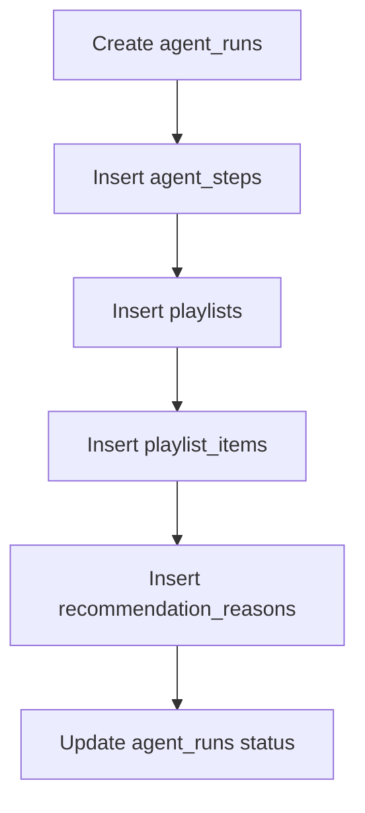
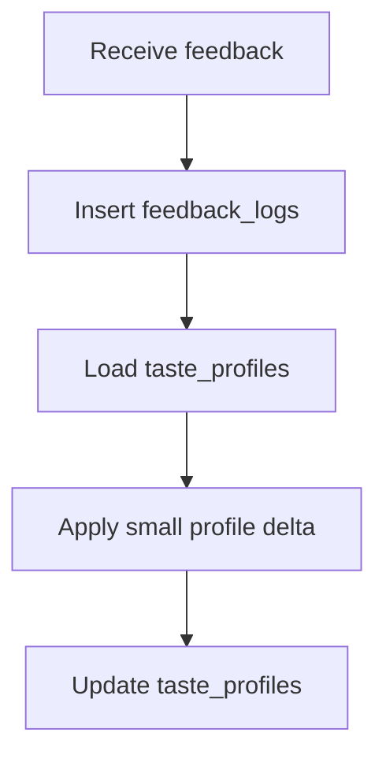

# SingFlow AI Database Schema

<!-- 中文说明：本文档定义数据库表、字段、关系、索引和约束建议，后续 schema/migration 必须与这里保持一致。 -->

## 1. Schema Principles

<!-- 中文说明：这一节说明数据库只保存产品状态和版权安全元数据，不保存歌词、音频、MV 或真实封面。 -->

1. Use PostgreSQL as the source of truth.
2. Use UUID primary keys for all product entities.
3. Store music metadata only; do not store lyrics, audio files, MV URLs, or unauthorized cover art.
4. Store Agent workflow records for auditability.
5. Store feedback as immutable logs before deriving taste memory.
6. Use JSONB only for flexible evidence or summary data; core query fields should be typed columns.

## 2. Common Conventions

<!-- 中文说明：这一节统一主键、时间戳、状态字段和 JSONB 使用规则，避免后续表结构风格不一致。 -->

| Convention | Rule |
| --- | --- |
| Primary key | `id UUID PRIMARY KEY DEFAULT gen_random_uuid()` |
| Timestamps | `created_at TIMESTAMPTZ NOT NULL DEFAULT now()` |
| Updates | Use `updated_at TIMESTAMPTZ` when a row mutates |
| Status fields | Use constrained text or database enum |
| Arrays | Use `TEXT[]` for genres, moods, languages when simple |
| Flexible evidence | Use `JSONB` for scored evidence and tool summaries |

Recommended PostgreSQL extensions:

```sql
CREATE EXTENSION IF NOT EXISTS pgcrypto;
```

Optional later:

```sql
CREATE EXTENSION IF NOT EXISTS vector;
```

Only enable `pgvector` when semantic embeddings are actually implemented.

## 3. Table: `songs`

<!-- 中文说明：这一节定义歌曲元数据表，只能存版权安全的 mock/授权元数据，并与 API_SPEC 的 Song 类型保持一致。 -->

Stores demo-safe song metadata used for search and recommendation.

| Field | Type | Required | Description |
| --- | --- | --- | --- |
| `id` | `UUID` | Yes | Primary key |
| `title` | `TEXT` | Yes | Fictional or licensed song title |
| `artist_name` | `TEXT` | Yes | Fictional or licensed artist display name |
| `language` | `TEXT` | Yes | Primary language: `en`, `zh`, `cantonese`, or `mixed` |
| `genres` | `TEXT[]` | Yes | Genre tags |
| `moods` | `TEXT[]` | Yes | Mood tags |
| `scene_tags` | `TEXT[]` | Yes | Scene tags such as `ktv`, `car`, `home_party`, `warmup`, `chorus`, `nostalgic`, `high_energy`, `late_night` |
| `energy` | `NUMERIC(4,3)` | Yes | `0.000` to `1.000` |
| `danceability` | `NUMERIC(4,3)` | No | Demo metadata score |
| `vocal_difficulty` | `NUMERIC(4,3)` | Yes | `0.000` easy to `1.000` hard |
| `bpm` | `INTEGER` | No | Beats per minute |
| `duration_seconds` | `INTEGER` | No | Song duration metadata |
| `release_year` | `INTEGER` | No | Optional year metadata |
| `popularity` | `NUMERIC(4,3)` | No | Demo popularity score |
| `cover_visual_seed` | `TEXT` | No | Seed for generated abstract cover visuals |
| `source_type` | `TEXT` | Yes | `mock`, `licensed`, or `public_domain` |
| `rights_status` | `TEXT` | Yes | `demo_safe`, `licensed`, `unknown_blocked` |
| `created_at` | `TIMESTAMPTZ` | Yes | Row creation time |
| `updated_at` | `TIMESTAMPTZ` | No | Last update time |

Relationships:

- One `songs` row can appear in many `playlist_items`.

Indexes:

| Index | Columns | Purpose |
| --- | --- | --- |
| `idx_songs_language` | `language` | Filter by language |
| `idx_songs_genres_gin` | `genres` GIN | Genre filtering |
| `idx_songs_moods_gin` | `moods` GIN | Mood filtering |
| `idx_songs_scene_tags_gin` | `scene_tags` GIN | Scene tag filtering |
| `idx_songs_energy` | `energy` | Energy range filtering |
| `idx_songs_rights_status` | `rights_status` | Block unsafe content |
| `idx_songs_search` | `to_tsvector(title || ' ' || artist_name)` | Text search |

## 4. Table: `users`

<!-- 中文说明：这一节定义 demo 用户和偏好归属，需与 `/demo-users`、`/users/{user_id}/taste-profiles` 等接口对应。 -->

Stores demo users and profile owners.

| Field | Type | Required | Description |
| --- | --- | --- | --- |
| `id` | `UUID` | Yes | Primary key |
| `display_name` | `TEXT` | Yes | User display name |
| `avatar_seed` | `TEXT` | No | Seed for generated avatar visual |
| `locale` | `TEXT` | No | Preferred locale, such as `en-US` or `zh-CN` |
| `demo_role` | `TEXT` | No | `host`, `guest`, `reviewer`, `developer` |
| `created_at` | `TIMESTAMPTZ` | Yes | Row creation time |
| `updated_at` | `TIMESTAMPTZ` | No | Last update time |

Relationships:

- One user can host many `karaoke_sessions`.
- One user can appear in many `group_members`.
- One user can own one or more `taste_profiles`.

Indexes:

| Index | Columns | Purpose |
| --- | --- | --- |
| `idx_users_display_name` | `display_name` | Demo user lookup |
| `idx_users_locale` | `locale` | Locale filtering |

## 5. Table: `karaoke_sessions`

<!-- 中文说明：这一节定义音乐场景会话，公开 API 统一通过 `/karaoke-sessions` 操作。 -->

Stores a scene-level music workflow session.

| Field | Type | Required | Description |
| --- | --- | --- | --- |
| `id` | `UUID` | Yes | Primary key |
| `host_user_id` | `UUID` | No | FK to `users.id` |
| `title` | `TEXT` | Yes | Session name |
| `scene_type` | `TEXT` | Yes | `ktv`, `car`, `home_party`, `custom` |
| `scene_prompt` | `TEXT` | No | User's natural language request |
| `status` | `TEXT` | Yes | `draft`, `active`, `ended`, `archived` |
| `target_energy_curve` | `TEXT` | No | `ramp_up`, `steady`, `cool_down`, `wave` |
| `constraints` | `JSONB` | No | Parsed filters and limits |
| `started_at` | `TIMESTAMPTZ` | No | Start time |
| `ended_at` | `TIMESTAMPTZ` | No | End time |
| `created_at` | `TIMESTAMPTZ` | Yes | Row creation time |
| `updated_at` | `TIMESTAMPTZ` | No | Last update time |

Relationships:

- A session has many `group_members`.
- A session has many `playlists`.
- A session has many `feedback_logs`.
- A session has many `agent_runs`.

Indexes:

| Index | Columns | Purpose |
| --- | --- | --- |
| `idx_sessions_host_user_id` | `host_user_id` | Host history |
| `idx_sessions_scene_type` | `scene_type` | Dashboard grouping |
| `idx_sessions_status` | `status` | Active session lookup |
| `idx_sessions_created_at` | `created_at DESC` | Recent sessions |

## 6. Table: `group_members`

<!-- 中文说明：这一节定义多人会话成员和权重，是 Group Taste Mixer 与偏好融合的基础。 -->

Connects users to a karaoke session with preference weights.

| Field | Type | Required | Description |
| --- | --- | --- | --- |
| `id` | `UUID` | Yes | Primary key |
| `karaoke_session_id` | `UUID` | Yes | FK to `karaoke_sessions.id` |
| `user_id` | `UUID` | Yes | FK to `users.id` |
| `role` | `TEXT` | Yes | `host`, `guest`, `observer` |
| `preference_weight` | `NUMERIC(4,3)` | Yes | `0.000` to `1.000`, default `1.000` |
| `preference_hint` | `TEXT` | No | Short user-provided taste hint |
| `joined_at` | `TIMESTAMPTZ` | Yes | Join time |
| `created_at` | `TIMESTAMPTZ` | Yes | Row creation time |

Relationships:

- Many members belong to one `karaoke_sessions` row.
- Each member references one `users` row.

Indexes:

| Index | Columns | Purpose |
| --- | --- | --- |
| `idx_group_members_session` | `karaoke_session_id` | Load session members |
| `idx_group_members_user` | `user_id` | User participation history |
| `uq_group_members_session_user` | `karaoke_session_id, user_id` unique | Prevent duplicate member rows |

## 7. Table: `taste_profiles`

<!-- 中文说明：这一节定义用户偏好记忆，反馈日志写入后才允许逐步更新这里的画像。 -->

Stores derived preference memory for a user.

| Field | Type | Required | Description |
| --- | --- | --- | --- |
| `id` | `UUID` | Yes | Primary key |
| `user_id` | `UUID` | Yes | FK to `users.id` |
| `profile_name` | `TEXT` | Yes | `default`, `ktv`, `car`, `home_party`, etc. |
| `favorite_genres` | `TEXT[]` | No | Positive genre tags |
| `avoided_genres` | `TEXT[]` | No | Negative genre tags |
| `language_affinity` | `JSONB` | Yes | Map like `{ "zh": 0.8, "en": 0.6 }` |
| `mood_affinity` | `JSONB` | Yes | Mood score map |
| `artist_affinity` | `JSONB` | No | Demo-safe artist score map |
| `energy_min` | `NUMERIC(4,3)` | No | Preferred lower energy bound |
| `energy_max` | `NUMERIC(4,3)` | No | Preferred upper energy bound |
| `vocal_difficulty_max` | `NUMERIC(4,3)` | No | Preferred difficulty ceiling |
| `confidence` | `NUMERIC(4,3)` | Yes | `0.000` to `1.000` profile confidence |
| `last_feedback_at` | `TIMESTAMPTZ` | No | Most recent feedback event used |
| `created_at` | `TIMESTAMPTZ` | Yes | Row creation time |
| `updated_at` | `TIMESTAMPTZ` | No | Last update time |

Relationships:

- One user can own multiple context-specific profiles.
- Feedback updates mutate this table after `feedback_logs` is inserted.

Indexes:

| Index | Columns | Purpose |
| --- | --- | --- |
| `idx_taste_profiles_user` | `user_id` | Load user profile |
| `uq_taste_profiles_user_name` | `user_id, profile_name` unique | One profile per context |
| `idx_taste_profiles_updated_at` | `updated_at DESC` | Dashboard freshness |

## 8. Table: `playlists`

<!-- 中文说明：这一节定义生成歌单容器，需能追溯到 karaoke session 和 agent run。 -->

Stores generated playlist containers.

| Field | Type | Required | Description |
| --- | --- | --- | --- |
| `id` | `UUID` | Yes | Primary key |
| `karaoke_session_id` | `UUID` | Yes | FK to `karaoke_sessions.id` |
| `agent_run_id` | `UUID` | No | FK to `agent_runs.id` |
| `created_by_user_id` | `UUID` | No | FK to `users.id` |
| `title` | `TEXT` | Yes | Playlist title |
| `description` | `TEXT` | No | Short generated description |
| `scene_type` | `TEXT` | Yes | Copied for easier dashboard filtering |
| `generation_prompt` | `TEXT` | No | Prompt used for generation |
| `status` | `TEXT` | Yes | `draft`, `generated`, `edited`, `archived` |
| `target_length` | `INTEGER` | Yes | Requested item count |
| `score_summary` | `JSONB` | No | Aggregate scoring evidence |
| `created_at` | `TIMESTAMPTZ` | Yes | Row creation time |
| `updated_at` | `TIMESTAMPTZ` | No | Last update time |

Relationships:

- One playlist belongs to one session.
- One playlist has many `playlist_items`.
- One playlist can be produced by one `agent_runs` row.

Indexes:

| Index | Columns | Purpose |
| --- | --- | --- |
| `idx_playlists_session` | `karaoke_session_id` | Load session playlists |
| `idx_playlists_agent_run` | `agent_run_id` | Trace generation |
| `idx_playlists_status` | `status` | Workflow state |
| `idx_playlists_created_at` | `created_at DESC` | Recent playlist list |

## 9. Table: `playlist_items`

<!-- 中文说明：这一节定义歌单中的有序推荐项，排序和 fit_score 必须稳定可解释。 -->

Stores ordered song recommendations.

| Field | Type | Required | Description |
| --- | --- | --- | --- |
| `id` | `UUID` | Yes | Primary key |
| `playlist_id` | `UUID` | Yes | FK to `playlists.id` |
| `song_id` | `UUID` | Yes | FK to `songs.id` |
| `position` | `INTEGER` | Yes | 1-based order |
| `fit_score` | `NUMERIC(5,4)` | Yes | Final score `0.0000` to `1.0000` |
| `score_breakdown` | `JSONB` | No | Scene, group, mood, feedback scores |
| `transition_note` | `TEXT` | No | Why it appears at this position |
| `source` | `TEXT` | Yes | `agent`, `manual`, `seed` |
| `created_at` | `TIMESTAMPTZ` | Yes | Row creation time |
| `updated_at` | `TIMESTAMPTZ` | No | Last update time |

Relationships:

- Each item references one playlist and one song.
- Each item can receive many feedback logs.
- Each item should have at least one recommendation reason.

Indexes:

| Index | Columns | Purpose |
| --- | --- | --- |
| `idx_playlist_items_playlist` | `playlist_id` | Load items |
| `uq_playlist_items_position` | `playlist_id, position` unique | Stable order |
| `idx_playlist_items_song` | `song_id` | Song recommendation history |
| `idx_playlist_items_fit_score` | `fit_score DESC` | Ranking inspection |

## 10. Table: `feedback_logs`

<!-- 中文说明：这一节定义不可变反馈日志，偏好记忆必须基于这里的记录更新。 -->

Stores immutable feedback events.

| Field | Type | Required | Description |
| --- | --- | --- | --- |
| `id` | `UUID` | Yes | Primary key |
| `karaoke_session_id` | `UUID` | Yes | FK to `karaoke_sessions.id` |
| `playlist_id` | `UUID` | No | FK to `playlists.id` |
| `playlist_item_id` | `UUID` | No | FK to `playlist_items.id` |
| `song_id` | `UUID` | No | FK to `songs.id` for direct feedback |
| `user_id` | `UUID` | No | FK to `users.id` |
| `feedback_type` | `TEXT` | Yes | `liked`, `skipped`, `too_slow`, `too_intense`, `too_high`, `wrong_language`, `great_for_group` |
| `rating` | `INTEGER` | No | Optional 1 to 5 rating |
| `reason` | `TEXT` | No | User-entered short note |
| `event_payload` | `JSONB` | No | Client context and metadata |
| `created_at` | `TIMESTAMPTZ` | Yes | Event time |

Relationships:

- Feedback belongs to a session.
- Feedback may target a playlist item, song, or whole session.
- Feedback triggers updates to `taste_profiles`.

Indexes:

| Index | Columns | Purpose |
| --- | --- | --- |
| `idx_feedback_session` | `karaoke_session_id` | Session feedback view |
| `idx_feedback_user` | `user_id` | User memory updates |
| `idx_feedback_item` | `playlist_item_id` | Item-level feedback |
| `idx_feedback_type` | `feedback_type` | Dashboard distribution |
| `idx_feedback_created_at` | `created_at DESC` | Recent feedback |

## 11. Table: `agent_runs`

<!-- 中文说明：这一节定义一次 AI 工作流执行，用于 Agent Console 和工程可观测性。 -->

Stores one AI workflow execution.

| Field | Type | Required | Description |
| --- | --- | --- | --- |
| `id` | `UUID` | Yes | Primary key |
| `karaoke_session_id` | `UUID` | No | FK to `karaoke_sessions.id` |
| `user_id` | `UUID` | No | User who initiated run |
| `objective` | `TEXT` | Yes | Human-readable run objective |
| `run_type` | `TEXT` | Yes | `playlist_generation`, `feedback_memory`, `dashboard_summary` |
| `status` | `TEXT` | Yes | `queued`, `running`, `succeeded`, `failed`, `cancelled` |
| `model_provider` | `TEXT` | Yes | `mock`, `openai`, or future provider |
| `model_name` | `TEXT` | No | Model identifier when available |
| `input_summary` | `JSONB` | No | Sanitized prompt and constraints |
| `output_summary` | `JSONB` | No | Final structured result summary |
| `error_message` | `TEXT` | No | Failure details safe for display |
| `started_at` | `TIMESTAMPTZ` | No | Run start |
| `ended_at` | `TIMESTAMPTZ` | No | Run end |
| `latency_ms` | `INTEGER` | No | Total latency |
| `created_at` | `TIMESTAMPTZ` | Yes | Row creation time |

Relationships:

- One run can have many `agent_steps`.
- One run can produce one or more playlists.
- One run can produce recommendation reasons.

Indexes:

| Index | Columns | Purpose |
| --- | --- | --- |
| `idx_agent_runs_session` | `karaoke_session_id` | Session trace |
| `idx_agent_runs_status` | `status` | Active run lookup |
| `idx_agent_runs_type` | `run_type` | Dashboard grouping |
| `idx_agent_runs_created_at` | `created_at DESC` | Recent runs |

## 12. Table: `agent_steps`

<!-- 中文说明：这一节定义 Agent 工具调用和阶段步骤，前端时间线必须基于这些持久化记录。 -->

Stores ordered internal workflow steps and tool calls.

| Field | Type | Required | Description |
| --- | --- | --- | --- |
| `id` | `UUID` | Yes | Primary key |
| `agent_run_id` | `UUID` | Yes | FK to `agent_runs.id` |
| `step_index` | `INTEGER` | Yes | 1-based ordered step |
| `step_type` | `TEXT` | Yes | `plan`, `tool_call`, `rank`, `explain`, `memory_write`, `finalize` |
| `tool_name` | `TEXT` | No | Tool name for tool steps |
| `status` | `TEXT` | Yes | `queued`, `running`, `succeeded`, `failed`, `skipped` |
| `input_summary` | `JSONB` | No | Sanitized input |
| `output_summary` | `JSONB` | No | Sanitized output |
| `error_message` | `TEXT` | No | Failure detail |
| `started_at` | `TIMESTAMPTZ` | No | Step start |
| `ended_at` | `TIMESTAMPTZ` | No | Step end |
| `latency_ms` | `INTEGER` | No | Step latency |
| `created_at` | `TIMESTAMPTZ` | Yes | Row creation time |

Relationships:

- Each step belongs to one `agent_runs` row.

Indexes:

| Index | Columns | Purpose |
| --- | --- | --- |
| `idx_agent_steps_run` | `agent_run_id` | Load timeline |
| `uq_agent_steps_run_index` | `agent_run_id, step_index` unique | Stable ordering |
| `idx_agent_steps_status` | `status` | Error and active state |
| `idx_agent_steps_tool_name` | `tool_name` | Tool usage analytics |

## 13. Table: `recommendation_reasons`

<!-- 中文说明：这一节定义推荐理由，确保每个生成歌曲推荐都能解释给用户和评审者看。 -->

Stores explanations tied to playlist items.

| Field | Type | Required | Description |
| --- | --- | --- | --- |
| `id` | `UUID` | Yes | Primary key |
| `playlist_item_id` | `UUID` | Yes | FK to `playlist_items.id` |
| `agent_run_id` | `UUID` | No | FK to `agent_runs.id` |
| `reason_type` | `TEXT` | Yes | `scene_fit`, `group_fit`, `energy_curve`, `memory`, `diversity` |
| `short_reason` | `TEXT` | Yes | User-facing concise explanation |
| `evidence` | `JSONB` | No | Score evidence and matched tags |
| `confidence` | `NUMERIC(4,3)` | No | Explanation confidence |
| `created_at` | `TIMESTAMPTZ` | Yes | Row creation time |

Relationships:

- Each reason belongs to one playlist item.
- A reason may be tied to the agent run that produced it.

Indexes:

| Index | Columns | Purpose |
| --- | --- | --- |
| `idx_reasons_playlist_item` | `playlist_item_id` | Load item reasons |
| `idx_reasons_agent_run` | `agent_run_id` | Trace generation |
| `idx_reasons_type` | `reason_type` | Dashboard explanation distribution |

## 14. Relationship Rules

<!-- 中文说明：这一节定义跨表关系规则和服务层约束，避免生成数据缺失理由或越过版权安全过滤。 -->

| Rule | Enforcement |
| --- | --- |
| Playlist items must have stable order | Unique index on `playlist_id, position` |
| Group member duplicates are not allowed | Unique index on `karaoke_session_id, user_id` |
| Feedback must be immutable | Do not update feedback rows except exceptional moderation fields if later added |
| Reasons are required for generated items | Service layer must create at least one reason per `playlist_items` row |
| Unsafe song content must be blocked | Query only `rights_status IN ('demo_safe', 'licensed')` |

## 15. Status Field Constraints

<!-- 中文说明：这一节明确 status 字段枚举值，实现时可用数据库 enum 或 constrained text。 -->

| Table | Field | Allowed Values |
| --- | --- | --- |
| `karaoke_sessions` | `status` | `draft`, `active`, `ended`, `archived` |
| `playlists` | `status` | `draft`, `generated`, `edited`, `archived` |
| `agent_runs` | `status` | `queued`, `running`, `succeeded`, `failed`, `cancelled` |
| `agent_steps` | `status` | `queued`, `running`, `succeeded`, `failed`, `skipped` |

## 16. Score Check Constraints

<!-- 中文说明：这一节补充 0 到 1 评分字段的 CHECK 约束建议，避免推荐分和偏好分写入异常值。 -->

Recommended CHECK constraints:

| Table | Field | Constraint |
| --- | --- | --- |
| `songs` | `energy` | `energy >= 0 AND energy <= 1` |
| `songs` | `danceability` | `danceability IS NULL OR (danceability >= 0 AND danceability <= 1)` |
| `songs` | `vocal_difficulty` | `vocal_difficulty >= 0 AND vocal_difficulty <= 1` |
| `songs` | `popularity` | `popularity IS NULL OR (popularity >= 0 AND popularity <= 1)` |
| `group_members` | `preference_weight` | `preference_weight >= 0 AND preference_weight <= 1` |
| `taste_profiles` | `confidence` | `confidence >= 0 AND confidence <= 1` |
| `taste_profiles` | `energy_min` | `energy_min IS NULL OR (energy_min >= 0 AND energy_min <= 1)` |
| `taste_profiles` | `energy_max` | `energy_max IS NULL OR (energy_max >= 0 AND energy_max <= 1)` |
| `taste_profiles` | `vocal_difficulty_max` | `vocal_difficulty_max IS NULL OR (vocal_difficulty_max >= 0 AND vocal_difficulty_max <= 1)` |
| `playlist_items` | `fit_score` | `fit_score >= 0 AND fit_score <= 1` |
| `recommendation_reasons` | `confidence` | `confidence IS NULL OR (confidence >= 0 AND confidence <= 1)` |

## 17. Demo Bootstrap Rules

<!-- 中文说明：这一节说明 demo seed 初始化规则，保证本地演示可重复且不会插入版权风险内容。 -->

Seed scripts should be idempotent and safe to run multiple times.

Bootstrap requirements:

1. Create at least one default host user.
2. Create several demo guest users for group preference fusion.
3. Create context profiles in `taste_profiles` for the default demo users.
4. Create at least 80 fictional songs for MVP seed data.
5. Expand to at least 150 fictional songs for Flagship seed data.
6. Cover `en`, `zh`, `cantonese`, and `mixed` languages.
7. Cover `ktv`, `car`, `home_party`, `warmup`, `chorus`, `nostalgic`, `high_energy`, and `late_night` scene tags.
8. Do not insert lyrics, audio, MV links, real album covers, scraped platform assets, or brand logos.

## 18. Core Write Flows

<!-- 中文说明：这一节说明关键写入顺序，尤其是 Agent 生成和反馈记忆不能只停留在内存里。 -->

### Playlist Generation Write Flow



Executable rules:

1. Create `agent_runs` before writing playlist output.
2. Write `agent_steps` as the workflow progresses.
3. Insert `recommendation_reasons` for every generated `playlist_items` row.
4. Mark the run as `failed` if playlist persistence fails.

### Feedback Memory Write Flow



Executable rules:

1. Never update taste memory before `feedback_logs` is written.
2. Keep feedback rows immutable.
3. Apply bounded preference deltas, not full profile overwrites.
4. Store `last_feedback_at` after successful profile update.

## 19. Example Safe Seed Row

<!-- 中文说明：这是安全 seed 示例，只包含 mock 元数据和场景标签，不包含任何歌词、音频或真实封面。 -->

```json
{
  "title": "Neon Harbor",
  "artist_name": "Studio Echo",
  "language": "en",
  "genres": ["synth_pop", "karaoke_pop"],
  "moods": ["bright", "night_drive"],
  "scene_tags": ["ktv", "warmup", "late_night"],
  "energy": 0.72,
  "vocal_difficulty": 0.38,
  "bpm": 116,
  "source_type": "mock",
  "rights_status": "demo_safe"
}
```
