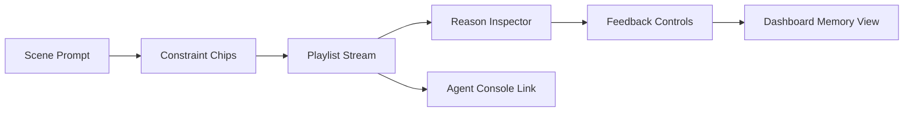

# SingFlow AI Design System

<!-- 中文说明：本文档把视觉语言、组件规则和页面质量标准固定下来，后续前端开发必须以此为准。 -->

## 1. Visual Direction

<!-- 中文说明：这一节定义作品集旗舰级视觉方向：高级、克制、有音乐能量，但不能复制任何品牌元素。 -->

SingFlow AI should feel like a premium AI music operations studio:

- Apple-like restraint: generous spacing, careful hierarchy, calm surfaces.
- Spotify-like atmosphere: dark music context, content streams, album-card energy.
- Linear-like clarity: precise borders, readable density, functional dashboards.
- Raycast-like command speed: compact controls, keyboard-friendly actions, crisp feedback.
- Vercel-like engineering polish: clean typography, strong contrast, minimal noise.
- Awwwards music-site energy: immersive hero moments, motion, and sound-reactive visuals without sacrificing usability.

The product must not copy any brand UI, logo, trademark, exact layout, color recipe, or proprietary asset.

## 2. Design Principles

<!-- 中文说明：这一节用于指导具体页面取舍，尤其避免把项目做成普通后台管理系统。 -->

| Principle | Rule |
| --- | --- |
| Studio first | The first screen should be a usable AI music studio with optional Hero Studio presentation quality |
| Showcase ready | `/showcase` or `/landing` may exist for README screenshots and portfolio demos, but must not replace the Studio workflow |
| Explainable AI | Recommendation reasons and agent steps should be visible as product features |
| Dark but readable | Dark surfaces need clear contrast, not muddy low-contrast panels |
| Dense but calm | Dashboards can be information-rich but must keep spacing and alignment disciplined |
| Music energy | Use waveform, tempo, mood, and cover-grid metaphors as original visual language |
| No brand cloning | Inspiration is allowed; direct copying is not |

## 3. Color System

<!-- 中文说明：这一节提供前端可直接落地的色彩 token，保持深色音乐氛围但避免单一紫蓝色。 -->

Use a dark neutral foundation with selective high-energy accents. Avoid a one-note purple, blue, beige, or brown theme.

### Core Tokens

| Token | Value | Usage |
| --- | --- | --- |
| `--color-bg-root` | `#07080B` | App background |
| `--color-bg-elevated` | `#101218` | Panels, sidebar, command areas |
| `--color-bg-glass` | `rgba(20, 24, 32, 0.62)` | Glass surfaces |
| `--color-bg-hover` | `#171B24` | Hover state |
| `--color-border-subtle` | `rgba(255, 255, 255, 0.08)` | Default borders |
| `--color-border-strong` | `rgba(255, 255, 255, 0.18)` | Active panels |
| `--color-text-primary` | `#F7F8FA` | Main text |
| `--color-text-secondary` | `#B7BCC8` | Secondary text |
| `--color-text-muted` | `#747B8C` | Metadata |
| `--color-accent-mint` | `#2FE6A6` | Positive fit, active generation |
| `--color-accent-coral` | `#FF6B6B` | High-energy, warnings when muted |
| `--color-accent-cyan` | `#66D9EF` | Agent/tool states |
| `--color-accent-amber` | `#F7C948` | Attention, confidence, pending |
| `--color-accent-violet` | `#9B8CFF` | AI highlights, used sparingly |
| `--color-danger` | `#FF4D5E` | Error and destructive actions |
| `--color-success` | `#31D0AA` | Success states |

### Semantic Usage

| Surface | Background | Border | Text |
| --- | --- | --- | --- |
| App shell | `--color-bg-root` | none | `--color-text-primary` |
| Sidebar | `--color-bg-elevated` | `--color-border-subtle` | Primary and secondary |
| Main panel | transparent or glass | `--color-border-subtle` | Primary |
| Playlist card | `rgba(255,255,255,0.045)` | `--color-border-subtle` | Primary |
| Agent step active | cyan-tinted glass | cyan border at 28% opacity | Primary |
| Feedback positive | mint tint | mint border at 24% opacity | Primary |
| Feedback negative | coral tint | coral border at 24% opacity | Primary |

### Gradient Rules

<!-- 中文说明：允许和音乐能量、声波、Agent 状态相关的克制光效，禁止廉价装饰性渐变球。 -->

Allowed:

- Subtle radial light behind the active studio area.
- Cover-art placeholders using multi-accent gradients.
- Small accent lines for energy, mood, or progress.
- Low-opacity radial glow tied to Agent state, playback energy, waveform intensity, or spectrum activity.
- Spectrum light and waveform backgrounds when they clarify music energy or workflow state.

Not allowed:

- Full-screen purple-blue gradient as the main visual identity.
- Low-quality decorative gradient orbs or bokeh blobs that are not connected to product state.
- Brand-identifiable gradients copied from existing products.

## 4. Typography

<!-- 中文说明：这一节定义字体层级，确保 Studio、Dashboard 和 Showcase 页面都有专业信息层级。 -->

### Font Stack

Use system-quality sans fonts with strong rendering in English and Chinese.

```css
font-family:
  Inter,
  "Geist",
  "SF Pro Display",
  "PingFang SC",
  "Microsoft YaHei",
  system-ui,
  sans-serif;
```

### Type Scale

| Token | Size | Line Height | Weight | Usage |
| --- | --- | --- | --- | --- |
| `--text-display` | `48px` | `56px` | `650` | Rare first-viewport product title |
| `--text-h1` | `36px` | `44px` | `650` | Page title |
| `--text-h2` | `28px` | `36px` | `620` | Section title |
| `--text-h3` | `20px` | `28px` | `600` | Panel title |
| `--text-body` | `15px` | `24px` | `400` | Default text |
| `--text-body-strong` | `15px` | `24px` | `560` | Labels and emphasis |
| `--text-caption` | `13px` | `18px` | `450` | Metadata |
| `--text-micro` | `11px` | `14px` | `600` | Badges and table labels |

Rules:

1. Do not scale type directly with viewport width.
2. Letter spacing should be `0` by default.
3. Use uppercase only for short labels, never for full sentences.
4. Keep dashboard headings compact; reserve display size for true hero/studio moments.

## 5. Spacing System

<!-- 中文说明：这一节用于保持页面空间感和可读性，避免后续组件随意堆叠导致截图不高级。 -->

Use a 4px base scale.

| Token | Value | Usage |
| --- | --- | --- |
| `--space-1` | `4px` | Icon gap, micro spacing |
| `--space-2` | `8px` | Tight controls |
| `--space-3` | `12px` | Card internal gaps |
| `--space-4` | `16px` | Default panel padding |
| `--space-5` | `20px` | Section rhythm |
| `--space-6` | `24px` | Large panel padding |
| `--space-8` | `32px` | Page grid gap |
| `--space-10` | `40px` | Major section spacing |
| `--space-12` | `48px` | Hero/studio spacing |

Layout rules:

1. Use stable grid tracks for dashboards and playlist layouts.
2. Avoid layout shifts when cards hover, load, or update.
3. Mobile spacing should reduce density but keep hierarchy.
4. Text must never overlap controls, cards, charts, or next sections.

## 6. Radius, Borders, and Shadows

<!-- 中文说明：这一节修正圆角规则：功能卡片要克制，Hero 和封面视觉块可以更有作品集展示感。 -->

### Radius Tokens

| Token | Value | Usage |
| --- | --- | --- |
| `--radius-1` | `4px` | Small tags, table cells |
| `--radius-2` | `6px` | Inputs, buttons, controls |
| `--radius-3` | `8px` | Functional cards, tables, compact panels |
| `--radius-4` | `10px` | Studio panels and inspector surfaces |
| `--radius-5` | `12px` | Larger Studio panels and modal surfaces |
| `--radius-hero` | `16px` | Hero visual cards and music cover blocks |
| `--radius-showcase` | `24px` | Showcase surfaces and large portfolio visuals |
| `--radius-pill` | `999px` | Avatars, segmented indicators, pills |

Rules:

1. Functional cards must use `8px` radius or less.
2. Studio panels may use `10px` to `12px` radius when they represent large workflow surfaces.
3. Hero visual cards, music cover blocks, and showcase surfaces may use `16px` to `24px` radius.
4. Toolbars and command inputs can use `6px` to feel precise.
5. Pills are allowed for status indicators and avatars.
6. Avoid nested cards. Use full-width bands or unframed layouts for sections.

### Border Tokens

| Token | Value | Usage |
| --- | --- | --- |
| `--border-subtle` | `1px solid rgba(255,255,255,0.08)` | Default panel border |
| `--border-active` | `1px solid rgba(255,255,255,0.18)` | Active panel |
| `--border-accent` | `1px solid rgba(102,217,239,0.32)` | Agent/tool focus |

### Shadow Tokens

| Token | Value | Usage |
| --- | --- | --- |
| `--shadow-soft` | `0 16px 40px rgba(0,0,0,0.28)` | Elevated surfaces |
| `--shadow-strong` | `0 24px 80px rgba(0,0,0,0.42)` | Modal or command palette |
| `--shadow-glow-mint` | `0 0 32px rgba(47,230,166,0.16)` | Active AI generation |
| `--shadow-glow-cyan` | `0 0 32px rgba(102,217,239,0.14)` | Agent tool state |

## 7. Glass and Surface Rules

<!-- 中文说明：玻璃质感要服务信息层级，不要为了装饰堆叠模糊层。 -->

Glass should support hierarchy, not become decoration.

| Surface | Backdrop Blur | Fill | Border | Usage |
| --- | --- | --- | --- | --- |
| Studio control bar | `18px` | `rgba(16,18,24,0.72)` | subtle | Persistent controls |
| Agent Console panel | `14px` | `rgba(12,15,22,0.72)` | cyan when active | Tool timeline |
| Playlist cards | `10px` | `rgba(255,255,255,0.045)` | subtle | Repeated content cards |
| Modal | `22px` | `rgba(12,15,22,0.88)` | strong | Focused actions |

Rules:

1. Glass panels need readable contrast behind them.
2. Do not stack glass cards inside glass cards.
3. Keep blur performance reasonable on mobile.
4. Use a solid fallback for browsers with limited backdrop-filter support.

## 8. Component Style Guide

<!-- 中文说明：这一节将组件做法具体化，Phase 1 静态页面也要按真实产品组件来做。 -->

### App Shell

| Element | Rule |
| --- | --- |
| Sidebar | Compact navigation with icons and active labels |
| Top bar | Session name, environment status, primary generation action |
| Main studio | Prompt composer, playlist stream, agent preview |
| Inspector | Recommendation reasons, selected song metadata, feedback |

### Buttons

| Type | Style | Usage |
| --- | --- | --- |
| Primary | Mint or cyan accent, dark text when contrast passes | Generate playlist, save session |
| Secondary | Transparent glass with subtle border | Edit, inspect, duplicate |
| Ghost | Text/icon only on hover surface | Toolbar actions |
| Danger | Red accent, used rarely | Delete session or clear feedback |

Rules:

1. Use icon buttons for tool actions such as save, download, undo, filter, inspect, and refresh.
2. Every unfamiliar icon must have a tooltip.
3. Text buttons are reserved for clear commands.
4. Loading states must preserve button width.

### Cards

| Card | Required Content |
| --- | --- |
| Playlist item | Position, cover placeholder, title, artist, score, mood, energy, reason |
| Song search result | Title, artist, language, genre, mood, vocal difficulty |
| Agent step | Step index, tool name, status, latency, summary |
| Dashboard metric | Label, value, delta, time range |

Card rules:

1. Functional repeated cards use `8px` radius or less.
2. Hero visual cards, music cover blocks, and showcase surfaces may use `16px` to `24px` radius.
3. Cards must not contain other cards.
4. Hover can change border, fill, and transform by at most `translateY(-1px)`.
5. Album placeholders should be original abstract visuals, not real cover art.

### Inputs

| Input | Rule |
| --- | --- |
| Scene prompt | Large but functional composer, not a chat-only interface |
| Filters | Segmented controls, menus, toggles, sliders |
| Search | Command-style input with immediate metadata results |
| Member weights | Stepper or slider with visible numeric value |

## 9. Page Layouts

<!-- 中文说明：这一节说明核心页面结构，首页可以有 Hero Studio 视觉，但必须直接进入可用工作流。 -->

### Primary Product Flow

The UI should guide users through a visible workflow instead of hiding the product behind a chat box.



Implementation rules:

1. Keep the prompt composer connected to playlist output and Agent Console.
2. Recommendation reasons must be visible from playlist cards.
3. Feedback controls should be one click away from each playlist item.
4. Dashboard links should feel like inspection tools, not a separate marketing area.

### Studio Page

<!-- 中文说明：Studio 首页是主体验入口，必须可操作，同时达到作品集截图级质量。 -->

Recommended desktop grid:

| Region | Width |
| --- | --- |
| Sidebar | `72px` collapsed or `240px` expanded |
| Main workflow | `minmax(520px, 1fr)` |
| Inspector | `360px` |

Mobile:

1. Sidebar becomes bottom or top icon navigation.
2. Inspector becomes a sheet or tab.
3. Playlist cards become single-column.
4. Agent Console can open as a full-screen view.

### Agent Console

<!-- 中文说明：Agent Console 是展示 AI 全栈能力的关键页面，要把工具调用和持久化步骤讲清楚。 -->

Layout:

1. Header with run status, objective, model, latency.
2. Timeline of ordered steps.
3. Selected step detail panel.
4. Tool input/output summaries.
5. Error or retry states.

### Dashboard

<!-- 中文说明：Dashboard 展示反馈记忆和 Agent 运行质量，不能做成普通 CRUD admin dashboard。 -->

Layout:

1. Top metric strip.
2. Session activity chart.
3. Feedback distribution.
4. Taste profile evolution.
5. Agent performance table.

### Showcase or Landing Page

<!-- 中文说明：该页面是可选展示页，用于 GitHub README 和作品集演示，不得替代 Studio 首页。 -->

Allowed routes:

| Route | Purpose | Required Constraint |
| --- | --- | --- |
| `/showcase` | Portfolio screenshot and guided demo | Must link into `/` Studio and use only original assets |
| `/landing` | Optional public presentation | Must not become the only meaningful product screen |

Visual direction:

1. Use real product surfaces from Studio, playlist, Agent Console, and Dashboard.
2. Use original abstract cover blocks, waveform backgrounds, or spectrum light tied to music state.
3. Do not use brand logos, real album covers, copyrighted imagery, or decorative glow with no product meaning.

## 10. Motion Principles

<!-- 中文说明：动效要增强状态理解，不能为了炫技影响性能和可访问性。 -->

| Motion | Duration | Easing | Use |
| --- | --- | --- | --- |
| Hover | `120ms` | `ease-out` | Buttons, cards |
| Panel enter | `180ms` | `cubic-bezier(0.2, 0.8, 0.2, 1)` | Inspector, modal |
| Agent step update | `220ms` | `ease-out` | Tool call appears |
| Playlist reorder | `240ms` | spring or smooth | Drag/reorder |
| Chart transition | `300ms` | `ease-out` | Dashboard updates |

Rules:

1. Motion should clarify state changes.
2. Avoid excessive parallax or background animation.
3. Respect `prefers-reduced-motion`.
4. Loading skeletons should match final layout dimensions.

## 11. Visual Fusion Guide

<!-- 中文说明：这一节解释“参考但不复制”的边界，避免视觉方向被误解成品牌克隆。 -->

| Reference | What to Learn | How SingFlow AI Uses It | What Not to Copy |
| --- | --- | --- | --- |
| Apple | Restraint, spacing, glass discipline | Calm surfaces and premium material feel | Product names, icons, exact layouts |
| Spotify | Dark music atmosphere, content energy | Playlist stream, cover-grid rhythm, music metadata density | Logo, green identity system, album art |
| Linear | Clarity, border precision, compact dashboards | Agent Console and issue-like run inspection | Exact sidebar and issue UI |
| Raycast | Command speed, compact actions | Prompt composer and quick tool actions | Exact command palette styling |
| Vercel | Engineering confidence, clean docs feel | README, deployment section, crisp type | Brand marks or exact landing visuals |
| Awwwards music sites | Immersive mood and rhythm | Original waveform/energy visuals | Overdesigned pages that hurt workflow |

## 12. Accessibility and QA Rules

<!-- 中文说明：这一节是交付前检查清单，确保截图好看之外也能真实使用。 -->

1. Text contrast should meet WCAG AA where practical.
2. Interactive targets should be at least `40px` high on touch screens.
3. Keyboard navigation must work for primary workflows.
4. Focus rings must be visible on dark backgrounds.
5. Charts need labels or accessible summaries.
6. Screens must be checked at desktop, tablet, and mobile widths.
7. No text should overflow buttons or cards.
8. The UI must still be understandable without color alone.

## 13. Phase 1 Visual Acceptance Bar

<!-- 中文说明：Phase 1 是作品集门面，静态原型也必须达到可放入 README 的截图质量。 -->

Phase 1 pages must be screenshot-grade and should not look like a generic admin dashboard.

Required page quality:

| Page | Visual Requirement |
| --- | --- |
| Studio Home | Hero Studio composition, usable prompt composer, playlist/Agent preview |
| AI Session Planner | Scenario planning controls with rich but restrained workflow layout |
| Playlist Timeline | Music-first timeline cards with reasons and energy progression |
| Group Taste Mixer | Preference fusion visualization with clear member weights |
| Agent Console Preview | Tool timeline, step states, latency, and traceability |
| Dashboard / Feedback Memory | Metrics, feedback distribution, and taste memory visuals |

Each page must include mock data, empty state, loading state, hover state, and mobile adaptation.
