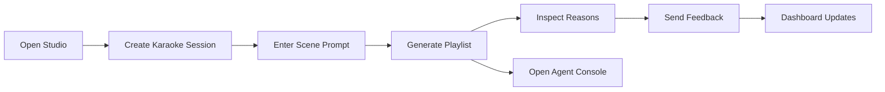

# SingFlow AI Product Requirements

<!-- 中文说明：本文档定义 SingFlow AI 的产品边界、MVP 范围、旗舰版范围和版权安全线，是后续开发判断“该不该做”的主依据。 -->

## 1. Product Positioning

<!-- 中文说明：这一节强调 SingFlow AI 是 AI 音乐场景编排平台，不是普通点歌系统，也不是普通聊天机器人。 -->

SingFlow AI is an AI Native Karaoke & Music Workflow Studio for KTV rooms, in-car entertainment systems, family music devices, and demo-grade music workflow scenarios.

It is not a simple chat bot and not a traditional song request system. The product goal is to show how AI can orchestrate a complete music scene workflow:

1. Understand a natural language music scenario.
2. Search and filter a licensed or mock song catalog.
3. Merge preferences from multiple people.
4. Generate a playable scene playlist.
5. Explain every recommendation.
6. Visualize the Agent workflow and tool calls.
7. Store feedback as long-term taste memory.
8. Provide dashboard views for product and engineering inspection.

### Product Statement

> SingFlow AI turns vague music intentions like "tonight is a relaxed road trip with three people who like different styles" into an explainable, editable, feedback-driven karaoke and music workflow.

### Project Goals

| Goal | Meaning | Success Signal |
| --- | --- | --- |
| Portfolio flagship | Show full-stack product thinking, not only UI screens | README, docs, demo, screenshots, and architecture are coherent |
| AI Native workflow | Agent/tool calling is visible and meaningful | Users can inspect agent runs, tool steps, inputs, outputs, and recommendation reasons |
| Commercial-grade frontend | Visual quality is suitable for a polished product demo | Dark music atmosphere, glass surfaces, refined spacing, responsive layouts |
| Engineering credibility | Backend, database, cache, and deployment are designed as real systems | FastAPI, PostgreSQL, Redis, Docker, migrations, typed contracts |
| Copyright-safe demo | Avoid illegal music content | No lyrics, no copyrighted audio, no MV downloads, no cloned brand assets |

### Entry Experience

<!-- 中文说明：这一节修正首页定位：保留 Studio-first，但允许首页具备作品集截图级 Hero Studio 视觉。 -->

The home page should be a usable Studio-first experience with portfolio-grade Hero Studio visuals. It may include a dramatic studio composition, active prompt composer, playlist preview, Agent status surface, or music-energy visual layer, as long as the user can understand and enter the real product workflow immediately.

Optional display routes are allowed:

| Route | Purpose | Rule |
| --- | --- | --- |
| `/` | Primary Studio-first home | Must expose usable studio workflow, not only marketing copy |
| `/showcase` | Portfolio/demo showcase | May be used for README screenshots, walkthroughs, and recruiter demos |
| `/landing` | Optional public-facing presentation page | Allowed only if it links clearly into the Studio and does not replace the product |

SingFlow AI must not become a pure marketing page, but the project should support polished showcase surfaces because it is a flagship portfolio project.

## 2. Target Users

<!-- 中文说明：这一节说明项目服务的真实使用者和作品集评审者，后续页面和功能要同时照顾产品体验与展示价值。 -->

| User Type | Scenario | Needs | Product Response |
| --- | --- | --- | --- |
| KTV host | Leads a group karaoke session | Build a balanced queue quickly | Natural language scene prompt, group preference fusion, queue editing |
| Friends group | Mixed music tastes in one room | Avoid one person's taste dominating | Weighted group members and transparent trade-off reasons |
| In-car passenger | Road trip, commute, night drive | Hands-free scene playlist generation | Short prompts, energy-aware recommendations, clear reasons |
| Family device user | Living room or home party | Safe, low-friction playlist | Mood and language filters, family-friendly metadata |
| Product reviewer / recruiter | Evaluates portfolio project | Wants to see product, code, architecture, reasoning | Dashboard, Agent Console, docs, deployment instructions |
| Developer / maintainer | Extends the project | Needs stable module boundaries | API spec, schema, AGENTS.md, roadmap phases |

## 3. Core Scenarios

<!-- 中文说明：这些核心场景决定 MVP 的主流程，后续开发不能只做一个孤立聊天框。 -->

### Scenario A: Natural Language Scene Playlist

User input:

```text
Create a warm-up playlist for four friends in a KTV room. Keep the first songs easy to sing, then slowly raise energy.
```

Expected workflow:

1. Parse scene: `ktv`, `warm_up`, `group`, `energy_ramp`.
2. Search song candidates from the local catalog.
3. Filter by language, mood, energy, popularity, vocal difficulty, and safety metadata.
4. Generate playlist order.
5. Explain each pick in product-friendly language.
6. Save playlist, reasons, and agent run steps.

### Scenario B: Multi-Person Preference Fusion

The host adds members with preference weights:

| Member | Preference Hints | Weight |
| --- | --- | --- |
| Alex | upbeat pop, easy chorus | 1.0 |
| Mina | mellow R&B, Mandarin songs | 0.8 |
| Jay | rock, high energy | 0.7 |

The system generates a balanced playlist and explains trade-offs:

- Opening songs favor shared familiarity and lower vocal difficulty.
- Middle section introduces higher energy.
- Later songs include stronger genre identity without making the whole queue one-note.

### Scenario C: Agent Console Inspection

A recruiter or developer opens an Agent Run:

1. Sees the user objective.
2. Sees each tool call in order.
3. Reviews candidate counts, scoring dimensions, and fallback decisions.
4. Checks recommendation reasons and feedback writes.
5. Understands how AI reasoning connects to database state.

### Scenario D: Feedback Memory Loop

After songs are played or skipped:

1. User taps feedback: `liked`, `skipped`, `too_high`, `too_slow`, `wrong_language`, `great_for_group`.
2. Feedback is written to `feedback_logs`.
3. Taste profile is updated asynchronously.
4. Future recommendations use the updated profile.
5. Dashboard shows preference drift over time.

## 4. Core Functions

<!-- 中文说明：这一节列出核心模块，后续 Codex 开发时不能删除或绕过这些模块。 -->

| Module | Function | MVP | Flagship |
| --- | --- | --- | --- |
| Song catalog | Search and filter songs by structured metadata | Yes | Yes |
| Scene prompt | Parse natural language into playlist constraints | Yes | Yes |
| Playlist generation | Produce ordered playlists with scores | Yes | Yes |
| Recommendation reasons | Explain why each song appears | Yes | Yes |
| Group preference fusion | Merge several users' tastes | Basic weighted merge | Advanced trade-off visualization |
| Feedback logs | Store song/session feedback | Yes | Yes |
| Taste memory | Update user profiles from feedback | Basic rules | Background jobs and confidence tracking |
| Agent Console | Show agent runs and tool calls | Read-only timeline | Rich graph, latency, token/cost metrics |
| Dashboard | Show sessions, feedback, reasons, agent activity | Basic metrics | Full analytics surface |
| Deployment | Docker Compose local demo | Yes | Production hardening notes |

## 5. MVP Scope

<!-- 中文说明：这一节定义第一版必须完成的最小可演示范围，避免项目在早期失控。 -->

The MVP must be good enough to demonstrate the core AI workflow end to end.

### MVP Must-Have Requirements

| Area | Requirement | Acceptance Criteria |
| --- | --- | --- |
| Frontend shell | Next.js app with polished dark studio UI | Responsive desktop and mobile screens render without layout overlap |
| Song catalog | Mock song library with structured metadata | At least 80 fictional songs, no real lyrics, audio links, MV links, or real album covers |
| Scene input | User can submit a natural language scene prompt | Planner can call the local mock playlist generation workflow with `mode=mock` from allowed local browser origins, show a generated preview, and keep a mock fallback |
| Playlist result | User sees ordered playlist cards | Each item shows title, demo artist, fit score, and safe reason preview; phase-level energy and mood can remain mock where backend fields are not available |
| Group taste mixer | User can inspect multi-person preference fusion | Mixer can read local backend session members, run mock-only taste fusion, show language/genre/energy/conflict summaries, and keep a mock fallback; local runtime verification confirmed backend direct taste-fusion and browser fusion rendering with `LLM_PROVIDER=mock` |
| Recommendation reasons | Each playlist item has a saved reason | Reasons are stored in `recommendation_reasons` |
| Feedback | User can submit feedback on playlist items | Feedback is stored in `feedback_logs` and visible in dashboard |
| Agent run log | Every generation creates an `agent_runs` record | Agent Console displays ordered `agent_steps` |
| Backend API | FastAPI exposes typed endpoints | OpenAPI docs work locally |
| Database | PostgreSQL schema covers required tables | Migrations can create all core tables |
| Cache | Redis is available for session or agent state | Docker Compose starts Redis with the stack |
| Docs | README and docs explain setup and architecture | New developer can run the project from instructions |

### MVP User Flow



### MVP Data Rules

<!-- 中文说明：这一节是 mock 数据底线，确保演示数据足够丰富且版权安全。 -->

1. Songs are demo metadata records only.
2. Song titles and artists should be fictional or clearly demo-safe.
3. No audio playback is required in MVP.
4. No real lyrics are stored.
5. User accounts can be local demo users without full authentication.
6. Agent output must be persisted, not only shown in memory.
7. MVP seed data must include at least 80 fictional songs.
8. MVP seed data must cover `zh`, `en`, `cantonese`, and `mixed` language values.
9. MVP seed data must cover scene tags including `ktv`, `car`, `home_party`, `warmup`, `chorus`, `nostalgic`, `high_energy`, and `late_night`.
10. MVP seed data must not include lyrics, audio files, MV links, real album covers, or scraped platform assets.

## 6. Flagship Scope

<!-- 中文说明：旗舰版范围用于体现求职作品集深度，包括更完整的数据规模、可视化和工程链路。 -->

The Flagship version expands the MVP into a portfolio-grade product demo with richer interaction and stronger engineering depth.

| Area | Flagship Capability | Notes |
| --- | --- | --- |
| Advanced frontend | Studio dashboard, Agent Console, playlist editor, taste profile view | Must feel like one coherent product |
| Streaming agent run | Tool steps appear progressively | Use SSE or WebSocket after baseline API works |
| Group fusion visualization | Show member contribution, conflicts, compromises | Radar, stacked bars, or matrix view |
| Taste memory | Feedback changes profile scores over time | Include confidence and recency weighting |
| Recommendation engine | Hybrid scoring: metadata, profiles, scene, feedback | Keep model explainable |
| Observability | Latency, step status, error state, retry state | Useful for recruiters inspecting architecture |
| Docker deployment | `web`, `api`, `postgres`, `redis`, optional worker | One-command local demo |
| Seed data | Reproducible mock dataset with at least 150 fictional songs | Covers `zh`, `en`, `cantonese`, `mixed`, and the core scene tags; no copyrighted lyrics/audio/MVs/covers |
| README polish | Screenshots, architecture diagram, demo script | Recruiter-friendly |

## 7. Explicit Non-Goals

<!-- 中文说明：这一节是产品边界，防止后续把项目做偏、做大或引入版权风险。 -->

These items must not be implemented unless the project owner explicitly changes the product direction in writing.

| Non-Goal | Reason |
| --- | --- |
| Generic chat bot as the main product | The product is a workflow studio, not a chat demo |
| Pure marketing site as the main product | Showcase routes are allowed, but the primary experience must remain Studio-first |
| Direct music streaming | Requires licensing and changes the project scope |
| Downloading songs, MVs, or karaoke tracks | Copyright and platform policy risk |
| Storing complete lyrics | Copyright risk |
| Copying Apple, Spotify, Linear, Raycast, or Vercel assets | Brand and trademark risk |
| Cloning any existing app screen one-to-one | The visual language should be inspired, not copied |
| Building a social network | Outside the core AI workflow |
| Complex paid auth or billing | Not needed for portfolio MVP |
| Training a custom music model | Too large for this project; use metadata and LLM reasoning |
| Scraping music platforms | Copyright, ToS, and data quality risk |

## 8. Copyright Boundary

<!-- 中文说明：这一节是版权安全边界，项目不能包含真实歌词、音频、MV、盗版伴奏或未经授权的专辑封面。 -->

### Allowed

| Content Type | Allowed Use |
| --- | --- |
| Fictional song metadata | Fully allowed for demo and seed data |
| Public domain or self-created metadata | Allowed if source is documented |
| Short generated recommendation explanations | Allowed when not quoting lyrics |
| Abstract album-art style placeholders | Allowed if original or generated safely |
| Product screenshots from this project | Allowed in README and portfolio |

### Not Allowed

| Content Type | Rule |
| --- | --- |
| Real song lyrics | Do not store, display, or generate lyrics |
| Copyrighted audio files | Do not include, link to, or download |
| Karaoke backing tracks | Do not include or link to unauthorized tracks |
| Music videos | Do not include or link to unauthorized MVs |
| Brand logos | Do not copy Apple, Spotify, Linear, Raycast, Vercel, or music platform logos |
| Album covers | Do not use copyrighted album art |

### Safe Demo Content Rules

<!-- 中文说明：这一节给出可执行的安全内容规则，后续 seed data 和 UI mock 都要遵守。 -->

1. Use fictional song names such as `Neon Harbor`, `Velvet Signal`, or `Afterglow Route`.
2. Use fictional artists such as `Demo Artist`, `Studio Echo`, or `Northline`.
3. Store only metadata needed for recommendations.
4. Use generated abstract cover art or CSS-driven visual placeholders.
5. If future real catalogs are integrated, store only licensed metadata and keep source attribution.
6. Use scene tags such as `ktv`, `car`, `home_party`, `warmup`, `chorus`, `nostalgic`, `high_energy`, and `late_night` instead of real platform playlist names.

## 9. Product Quality Bar

<!-- 中文说明：这一节定义作品集级质量标准，尤其强调视觉、AI 可解释性和安全边界。 -->

| Dimension | Minimum Bar |
| --- | --- |
| UX | The first screen must be a usable Studio-first experience; `/showcase` or `/landing` may support portfolio presentation |
| Visual | Layout must feel polished in desktop and mobile screenshots, with Phase 1 pages ready for README or portfolio use |
| AI | Agent steps must be inspectable and tied to data writes |
| Backend | API contracts and schema must match documentation |
| Docs | Every major module must have a clear purpose and operating instruction |
| Safety | No copyrighted media, no hard-coded secrets, no scraped assets |
