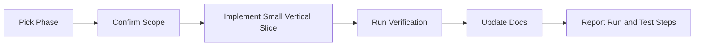

# SingFlow AI Roadmap

<!-- 中文说明：本文档把项目拆成可交给 Codex 执行的阶段计划，确保每个阶段都有目标、任务、验收标准和边界。 -->

## 1. Roadmap Principles

<!-- 中文说明：这一节定义路线图执行原则，强调先做真实工作流，再做展示包装。 -->

1. Build a real workflow studio before adding decorative polish.
2. Keep every phase demoable.
3. Preserve mock mode so the project can run without paid AI credentials.
4. Update docs whenever architecture, API, schema, or behavior changes.
5. Never add copyrighted lyrics, audio, MV links, copied logos, or scraped platform assets.

## 2. Phase Overview

<!-- 中文说明：这一节提供阶段总览，后续任务应尽量按 Phase 顺序推进。 -->

| Phase | Name | Main Outcome |
| --- | --- | --- |
| Phase 0 | Project initialization | Repo, tooling, docs, conventions |
| Phase 1 | Advanced frontend static prototype | Polished studio UI with mock data |
| Phase 2 | Backend and database | FastAPI, PostgreSQL, Redis, schema |
| Phase 2F | GitHub portfolio packaging | README polish, screenshot guide, API demo flow docs |
| Phase 2G | Backend Docker runtime verification | Local Docker backend runtime and API smoke checks passed |
| Phase 3 | AI playlist generation | Agent workflow creates playlists and reasons |
| Phase 4 | Multi-person preference fusion | Group member weighting and fusion visualization |
| Phase 5 | Agent Console | Tool-call timeline and run inspection |
| Phase 6 | Feedback memory | Feedback logs update taste profiles |
| Phase 7 | GitHub open-source packaging and deployment | README, screenshots, Docker, demo script |

### Phase Execution Flow

Executable rules:

1. Do phases in order unless the project owner explicitly reprioritizes.
2. Keep each phase demoable before starting the next one.
3. Do not skip docs updates when behavior, API, schema, setup, or design direction changes.
4. Do not add copyrighted content at any phase.

## 3. Phase 0: Project Initialization

<!-- 中文说明：Phase 0 只做项目基础设施和文档，不应擅自改 Git 历史或写业务功能。 -->

### Goal

Create a professional monorepo foundation for SingFlow AI.

### Tasks

| Task | Output |
| --- | --- |
| Initialize Git repository if needed | If the repository is not initialized, initialize Git only after owner approval. Do not modify existing Git history |
| Create monorepo structure | `apps/web`, `apps/api`, `docs`, root config |
| Add README | Product intro, stack, local setup placeholder |
| Add docs | Product, design, architecture, schema, API, roadmap |
| Add AGENTS.md | Codex development rules |
| Add env examples | `.env.example` without secrets |
| Choose package manager | Document `pnpm`, `npm`, or chosen tool |

### Acceptance Criteria

1. Repo has clear root structure.
2. Documentation files exist and agree on stack and modules.
3. No API keys, copyrighted media, lyrics, or cloned assets are committed.
4. README explains the project positioning in one minute.

### Not Doing

1. No production auth.
2. No real music streaming.
3. No backend business logic beyond scaffolding.

## 4. Phase 1: Advanced Frontend Static Prototype

<!-- 中文说明：Phase 1 是作品集门面，必须优先交付截图级高级前端，而不是普通 admin dashboard。 -->

### Goal

Build a visually polished, screenshot-grade static prototype that demonstrates the studio workflow using mock data.

Required screenshot-grade pages:

| Page | Required Focus |
| --- | --- |
| Studio Home | Studio-first home with optional Hero Studio visuals, prompt composer, playlist/Agent preview |
| AI Session Planner | Scenario planning controls, constraints, and session setup |
| Playlist Timeline | Ordered music timeline, energy curve, recommendation reasons |
| Group Taste Mixer | Member weights, preference fusion, conflict summaries |
| Agent Console Preview | Tool-call timeline, step states, latency, and run summary |
| Dashboard / Feedback Memory | Metrics, feedback distribution, taste profile evolution |

Each required page must include mock data, empty state, loading state, hover state, and mobile adaptation.

### Tasks

| Task | Output |
| --- | --- |
| Implement app shell | Sidebar, top bar, studio grid |
| Implement prompt composer | Scene prompt and generation action |
| Implement playlist stream | Mock playlist cards with scores and reasons |
| Implement inspector | Selected item detail and feedback controls |
| Implement Agent preview | Static step timeline |
| Implement dashboard page | Mock metrics and charts |
| Implement responsive views | Desktop and mobile layouts |
| Capture screenshots | README-ready images |
| Build required page states | Mock data, empty, loading, hover, and mobile states for all six required pages |

### Acceptance Criteria

1. First screen is a usable SingFlow AI Studio with optional portfolio-grade Hero Studio visuals.
2. UI follows `docs/DESIGN_SYSTEM.md`.
3. No layout overlap at common desktop and mobile widths.
4. Mock data uses fictional songs and demo artists only.
5. The prototype clearly communicates AI workflow orchestration, not a simple chat bot.
6. UI must not look like a generic CRUD admin dashboard.
7. Each required page must be suitable for GitHub README or portfolio screenshots.

### Not Doing

1. No real API calls.
2. No real LLM integration.
3. No copyrighted album art or audio.

## 5. Phase 2: Backend and Database

<!-- 中文说明：Phase 2 建立 FastAPI、PostgreSQL、Redis 和 seed data，公开会话 API 必须使用 `/karaoke-sessions`。 -->

### Goal

Create FastAPI backend, PostgreSQL schema, Redis connection, and seed data.

### Tasks

| Task | Output |
| --- | --- |
| Scaffold FastAPI app | `apps/api` with health check and OpenAPI |
| Add database models | Tables from `docs/DATABASE_SCHEMA.md` |
| Add migrations | Reproducible schema creation |
| Add seed script | At least 80 demo-safe fictional songs and demo users |
| Add Redis client | Health check and cache utility |
| Implement base APIs | Songs, `/karaoke-sessions`, members, playlists read |
| Add Docker Compose | `web`, `api`, `postgres`, `redis` |

### Acceptance Criteria

1. `docker compose up --build` starts core services or documented equivalent works.
2. `/docs` exposes typed FastAPI endpoints.
3. Migrations create all required tables.
4. Seed data includes at least 80 fictional songs for MVP.
5. Seed data covers `en`, `zh`, `cantonese`, and `mixed`.
6. Seed data covers `ktv`, `car`, `home_party`, `warmup`, `chorus`, `nostalgic`, `high_energy`, and `late_night`.
7. API does not expose lyrics, audio URLs, MV links, real album covers, scraped assets, or unsafe content.

### Not Doing

1. No advanced recommendation engine yet.
2. No production-grade auth.
3. No external music platform scraping.

### Current Phase 2 Packaging Status

Phase 2 has also added portfolio-facing packaging docs:

| Area | Status |
| --- | --- |
| GitHub README polish | Phase 2F documentation checkpoint prepared |
| Demo data docs | Completed with 96 fictional songs and mock/database-backed graph |
| Runtime verification guide | Completed |
| Docker/Postgres/API smoke verification | Phase 2G completed locally |
| Frontend API client foundation | Phase 2H-1 completed with GET-only wrappers |
| Dashboard partial API integration | Phase 2H-2 completed for backend overview and Agent run aggregates with mock fallback |
| Agent Console partial API integration | Phase 2H-3 completed for persisted Agent Run and Agent Step GET data with mock fallback |

Phase 2G verified:

1. Docker Compose config.
2. PostgreSQL and Redis health.
3. API image build and API container startup.
4. Alembic migration.
5. Demo bootstrap dry-run and normal mode.
6. Health, core API, and dynamic API smoke flows.

Follow-up work after Phase 2H-3:

1. Continue Phase 2H-4 Sessions / Timeline API integration.
2. Run runtime integration verification for the partial frontend API slices when Docker is available.
3. Prepare deployment documentation and environment hardening.
4. Keep any optional real LLM adapter rights-safe and explicitly approved in a later phase.
5. Add optional demo video or GIF after manual capture.

## 6. Phase 3: AI Playlist Generation

<!-- 中文说明：Phase 3 让 Agent 工作流真正产生歌单、理由和持久化步骤。 -->

### Goal

Implement the end-to-end playlist generation workflow with Agent Run persistence.

### Tasks

| Task | Output |
| --- | --- |
| Build agent workflow service | Parse, search, rank, build, explain, persist |
| Implement mock provider | Deterministic output without API key |
| Add LLM provider adapter | Environment-based optional provider |
| Implement `/playlists/generate` | Creates playlist, items, reasons, agent run |
| Persist agent steps | Tool-call timeline saved to database |
| Add frontend integration | Studio calls API and displays returned playlist |

### Acceptance Criteria

1. Generating a playlist creates `agent_runs`, `agent_steps`, `playlists`, `playlist_items`, and `recommendation_reasons`.
2. Mock mode works with no API key.
3. Each playlist item has at least one reason.
4. Failed LLM calls fall back to deterministic generation where possible.
5. Agent output is visible in frontend.

### Not Doing

1. No free-form chat interface as the main flow.
2. No opaque recommendations without stored reasons.
3. No API key committed to the repository.

## 7. Phase 4: Multi-Person Preference Fusion

<!-- 中文说明：Phase 4 展示多人偏好融合能力，是区别于普通点歌系统的重要模块。 -->

### Goal

Add group members, weighted preference fusion, and explainable compromise logic.

### Tasks

| Task | Output |
| --- | --- |
| Add member management UI | Add/remove/edit session members |
| Implement taste fusion service | Weighted merge of profiles and hints |
| Add fusion endpoint | `/karaoke-sessions/{id}/taste-fusion` |
| Visualize conflicts | Energy, language, genre trade-offs |
| Connect fusion to ranking | Group profile affects playlist scores |

### Acceptance Criteria

1. Session can include multiple members with weights.
2. Fusion output is inspectable in UI.
3. Recommendation scores reflect group preferences.
4. Conflicts are summarized without blaming users.
5. Single-member sessions still work.

### Not Doing

1. No social graph.
2. No account invitation system.
3. No complex permission model.

## 8. Phase 5: Agent Console

<!-- 中文说明：Phase 5 是 AI 全栈能力展示页，必须基于持久化 agent_runs 和 agent_steps。 -->

### Goal

Make the AI workflow visible as a flagship engineering feature.

### Tasks

| Task | Output |
| --- | --- |
| Build Agent Console route | `/agent-runs/[id]` |
| Add timeline component | Ordered steps, status, latency |
| Add step inspector | Input/output summaries and errors |
| Add dashboard linkage | Recent runs link to console |
| Optional streaming | SSE endpoint for active runs |

### Acceptance Criteria

1. Every generated playlist links to its Agent Run.
2. Console displays step order, status, tool name, latency, and summaries.
3. Failed steps render clear error states.
4. Tool calls are understandable to a recruiter without reading backend code.
5. Sensitive provider payloads and secrets are not shown.

### Not Doing

1. No raw chain-of-thought display.
2. No exposing secret keys or provider internals.
3. No fake steps disconnected from persisted data.

## 9. Phase 6: Feedback Memory

<!-- 中文说明：Phase 6 完成从用户反馈到偏好记忆的闭环，反馈日志必须先于画像更新。 -->

### Goal

Close the loop from user feedback to future recommendation behavior.

### Tasks

| Task | Output |
| --- | --- |
| Implement feedback API | `POST /feedback`, `GET /karaoke-sessions/{session_id}/feedback` |
| Add feedback UI | Like, skip, too slow, too intense, wrong language |
| Implement memory update service | Small profile deltas with recency |
| Show taste profile view | Current affinities and confidence |
| Add dashboard charts | Feedback distribution and taste evolution |

### Acceptance Criteria

1. Feedback writes immutable `feedback_logs`.
2. Taste profiles update after feedback.
3. Future playlist generation uses updated profiles.
4. Dashboard shows feedback and memory signals.
5. Failed profile updates do not erase feedback logs.

### Not Doing

1. No invasive personal data collection.
2. No hidden profile mutation without logged feedback.
3. No irreversible destructive feedback actions.

## 10. Phase 7: GitHub Open-Source Packaging and Deployment

<!-- 中文说明：Phase 7 把项目包装成可展示、可运行、可审查的旗舰作品集仓库。 -->

### Goal

Package the project as a credible flagship portfolio repository.

### Tasks

| Task | Output |
| --- | --- |
| Finalize README | Product story, screenshots, architecture, setup |
| Add deployment docs | Docker Compose and optional hosted deployment |
| Add demo script | Recruiter walkthrough path |
| Add screenshots | Studio, playlist, Agent Console, dashboard |
| Expand flagship seed data | At least 150 fictional songs across required languages and scene tags |
| Add tests | API service tests and critical UI tests |
| Add license | Appropriate open-source license |
| Add contribution notes | Safety and content rules |

### Acceptance Criteria

1. A new reviewer can run the project locally from README.
2. Screenshots show polished product surfaces.
3. Docs are consistent with implemented behavior.
4. Docker demo path works.
5. Repository contains no secrets or copyrighted music assets.
6. Flagship seed data includes at least 150 fictional songs.

### Not Doing

1. No pretending the demo has music rights it does not have.
2. No deploying with debug secrets.
3. No unfinished screenshots from broken UI states.

## 11. Development Handoff Format for Codex

<!-- 中文说明：这一节规定后续给 Codex 派发任务的格式，便于按阶段执行和验收。 -->

Every phase task given to Codex should include:

| Field | Example |
| --- | --- |
| Phase | `Phase 3` |
| Goal | `Implement mock agent workflow` |
| Files allowed | `apps/api/app/services`, `docs` |
| Acceptance criteria | `Creates agent_runs and playlist_items` |
| Verification | `Run API tests and manual generation request` |

Each completed phase must report:

1. Changed files.
2. How to run locally.
3. How it was tested.
4. Any docs updated.
5. Known limitations.
