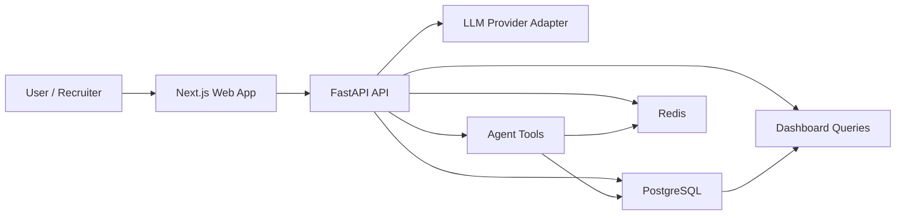
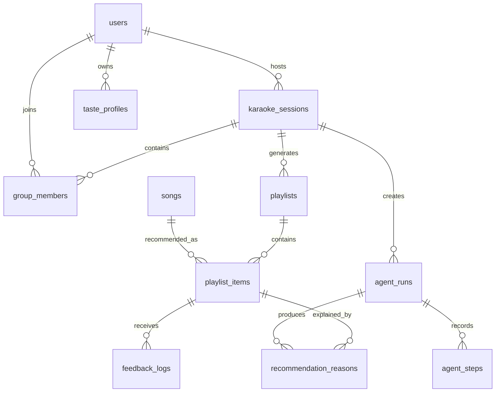
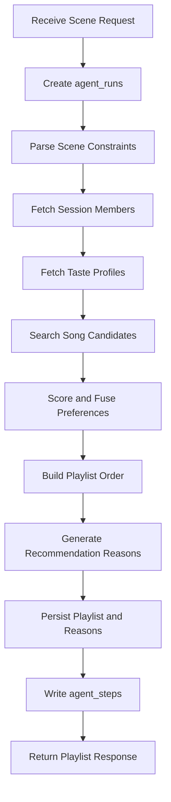
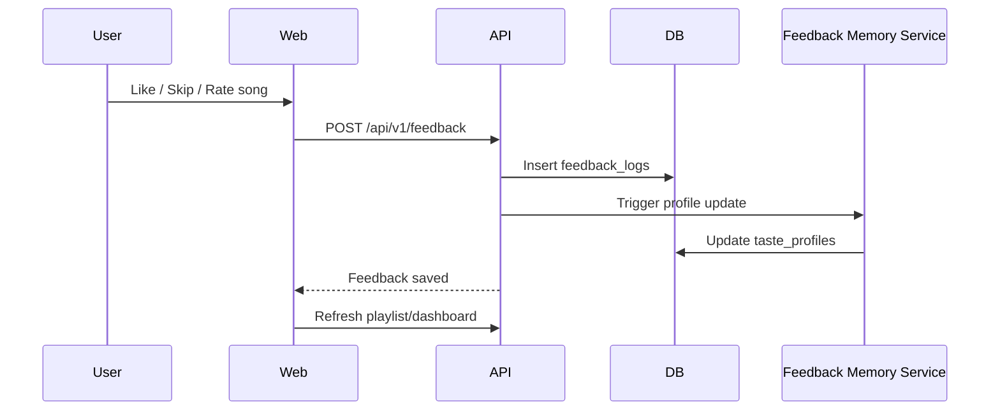

# SingFlow AI Technical Architecture

<!-- 中文说明：本文档定义前端、后端、数据库、AI Agent、Tool Calling 和 Docker 的协作关系，是实现阶段的技术蓝图。 -->

## 1. Architecture Overview

<!-- 中文说明：这一节从系统层面说明 SingFlow AI 是可追踪的 AI 工作流产品，而不是单点聊天功能。 -->

SingFlow AI uses a full-stack architecture built around a visible AI workflow.



### Stack

| Layer | Technology | Purpose |
| --- | --- | --- |
| Frontend | Next.js App Router, TypeScript | Studio UI, dashboard, Agent Console |
| Styling | Tailwind CSS, shadcn/ui, design tokens | Primary styling and component foundation |
| Visual effects | Framer Motion, CSS modules for isolated effects only | Motion, waveform, spectrum, and Hero Studio visual effects |
| Data fetching | TanStack Query with typed API clients | Server state, caching, and API integration |
| Client state | Zustand | Studio selections, composer state, inspector state |
| Tables and charts | TanStack Table, Recharts | Agent tables, dashboard charts, feedback analytics |
| Backend | FastAPI, Pydantic, SQLAlchemy | Typed API, service layer, validation |
| Database | PostgreSQL | Durable product data |
| Cache / Queue | Redis | Agent run state, short-lived cache, background task coordination |
| AI | LLM provider adapter | Prompt parsing, explanations, tool planning |
| Deployment | Docker Compose | Local full-stack demo |

## 2. Frontend Architecture

<!-- 中文说明：前端页面路由可以使用 `/sessions/[id]`，但后端 API 路由统一使用 `/karaoke-sessions`。 -->

### App Areas

| Route | Purpose | Primary Data |
| --- | --- | --- |
| `/` | Studio-first home with Hero Studio visuals | Current session, prompt, generated playlist |
| `/showcase` | Optional portfolio showcase | Screenshots, guided demo, product story |
| `/landing` | Optional public presentation page | Entry copy and links into Studio |
| `/library` | Song catalog browser | Songs, filters, search |
| `/sessions/[id]` | Frontend session detail page | Members, playlists, feedback from `/karaoke-sessions` API |
| `/agent-runs/[id]` | Agent Console | Agent run, ordered steps, tool summaries |
| `/dashboard` | Analytics dashboard | Session metrics, feedback trends, agent performance |
| `/settings` | Demo settings | Model provider, mock mode, profile settings |

### Suggested Frontend Folder Structure

```text
apps/web/
  app/
    page.tsx
    library/page.tsx
    sessions/[id]/page.tsx
    agent-runs/[id]/page.tsx
    dashboard/page.tsx
  components/
    studio/
    playlist/
    agent-console/
    dashboard/
    ui/
  lib/
    api-client.ts
    design-tokens.ts
    formatters.ts
  types/
    api.ts
```

### Frontend Rules

1. The first screen must be a usable Studio-first experience with optional portfolio-grade Hero Studio visuals.
2. API types must match `docs/API_SPEC.md`.
3. Agent Console must show real persisted `agent_runs` and `agent_steps`, not mock-only UI after backend integration.
4. Playlist cards must show recommendation reasons from `recommendation_reasons`.
5. Feedback actions must call backend APIs and update UI state.
6. UI must remain usable without an LLM key by using deterministic mock mode.
7. `/showcase` or `/landing` may exist for portfolio presentation, but they must not replace the Studio workflow.
8. Primary styling should use Tailwind CSS and shadcn/ui conventions; CSS modules are allowed only for isolated visual effects such as waveforms, spectrum light, or canvas-adjacent presentation details.
9. Phase 1 should first implement a complete mock-data flagship prototype before API integration.
10. After the backend is ready, replace mock data through typed API clients without changing the visual structure.

## 3. Backend Architecture

<!-- 中文说明：后端模块可以内部命名为 sessions，但公开 API 路径必须统一为 `/karaoke-sessions`。 -->

### API Modules

| Module | Responsibility |
| --- | --- |
| `songs` | Song catalog search, filtering, seed data access |
| `karaoke_sessions` | Karaoke session lifecycle and group members exposed through `/karaoke-sessions` |
| `users` | Demo users, taste profiles, and feedback summaries |
| `playlists` | Playlist generation, retrieval, item ordering |
| `feedback` | Feedback logs and memory update triggers |
| `agent_runs` | Agent run creation, status, step history |
| `dashboard` | Aggregated metrics and charts |
| `taste_profiles` | User preference data and derived profile updates |

### Suggested Backend Folder Structure

```text
apps/api/
  app/
    main.py
    api/
      routes/
        songs.py
        karaoke_sessions.py
        users.py
        playlists.py
        feedback.py
        agent_runs.py
        dashboard.py
    core/
      config.py
      security.py
      logging.py
    db/
      session.py
      models.py
      migrations/
    services/
      recommendation_service.py
      taste_fusion_service.py
      feedback_memory_service.py
      agent_service.py
    agents/
      workflow.py
      tools.py
      prompts.py
      provider.py
```

### Backend Rules

1. Do not put business logic directly in route handlers.
2. Use Pydantic request/response models for all public API contracts.
3. Use migrations for schema changes.
4. Store agent run records and steps for every playlist generation.
5. Keep LLM provider code behind an adapter so the app can run in mock mode.
6. API keys must come from environment variables only.
7. Public session APIs must use `/api/v1/karaoke-sessions`; do not introduce a shorter session API alias.

## 4. Database Design

<!-- 中文说明：数据库只保存产品状态和版权安全的 mock 元数据，不保存歌词、音频、MV 或真实封面。 -->

The database stores product state, not copyrighted content.

Core tables:

| Table | Purpose |
| --- | --- |
| `songs` | Demo-safe song metadata with language, mood, genre, and scene tags |
| `users` | Demo users and profile owners |
| `group_members` | Members attached to karaoke sessions |
| `taste_profiles` | Derived preference memory per user |
| `karaoke_sessions` | Scene context and session lifecycle |
| `playlists` | Generated playlist containers |
| `playlist_items` | Ordered song recommendations |
| `feedback_logs` | Feedback events from users |
| `agent_runs` | One AI workflow execution |
| `agent_steps` | Ordered tool/planning steps |
| `recommendation_reasons` | Explanations tied to playlist items |

Relationships:



## 5. AI Agent Workflow

<!-- 中文说明：这一节说明 AI 能力必须落到可持久化、可展示的 Agent 工作流，而不是普通聊天框。 -->

The Agent is a workflow orchestrator. It should not behave like a free-form chat assistant.

### Workflow Steps



### Agent Step Types

| Step Type | Description | Persisted In |
| --- | --- | --- |
| `plan` | Interpret objective and decide tool sequence | `agent_steps` |
| `tool_call` | Execute one deterministic tool | `agent_steps` |
| `rank` | Score and rank candidate songs | `agent_steps` |
| `explain` | Generate recommendation reasons | `agent_steps`, `recommendation_reasons` |
| `memory_write` | Store feedback or profile updates | `agent_steps`, `feedback_logs`, `taste_profiles` |
| `finalize` | Persist playlist result and return response | `agent_steps` |

## 6. Tool Calling Design

<!-- 中文说明：Tool Calling 要窄、可验证、可审计，每一步都能在 Agent Console 中解释。 -->

Tools should be narrow, typed, auditable functions. The LLM may choose or parameterize tools, but tools must enforce validation and data boundaries.

| Tool Name | Input | Output | Notes |
| --- | --- | --- | --- |
| `parse_scene_prompt` | prompt text, locale | scene type, mood, energy curve, constraints | Can run with LLM or deterministic mock |
| `search_song_catalog` | filters, query, limit | candidate songs | Reads `songs` only |
| `fetch_taste_profiles` | user IDs | taste profile summaries | Reads `taste_profiles` |
| `fuse_group_preferences` | member weights, profiles, scene | fusion vector and conflicts | Deterministic service |
| `rank_song_candidates` | candidates, fusion vector, scene | scored candidates | Deterministic service |
| `build_playlist` | scored candidates, length, sequencing rules | ordered playlist item drafts | Deterministic service |
| `generate_reasons` | playlist item drafts, scene, evidence | short reasons | LLM or template fallback |
| `write_feedback_memory` | feedback event | updated profile summary | Writes `feedback_logs` and profile updates |
| `summarize_agent_run` | steps | run summary | Used by dashboard and console |

### Tool Call Record Rule

Every tool call must create or update an `agent_steps` row with:

1. `step_index`
2. `step_type`
3. `tool_name`
4. `status`
5. `input_summary`
6. `output_summary`
7. `started_at`
8. `ended_at`
9. `error_message` when failed

## 7. Recommendation Flow

<!-- 中文说明：推荐流程必须可解释，所有评分维度都要能映射到 UI 理由或调试信息。 -->

### Scoring Dimensions

| Dimension | Source | Example |
| --- | --- | --- |
| Scene fit | Parsed prompt | `warm_up`, `road_trip`, `late_night` |
| Scene tag fit | Song metadata | `ktv`, `car`, `home_party`, `chorus`, `high_energy` |
| Mood fit | Song metadata | `bright`, `nostalgic`, `chill` |
| Energy fit | Song metadata and requested curve | Low start, higher middle |
| Vocal difficulty | Song metadata | Favor easy songs early in KTV |
| Language fit | User and group preferences | `zh`, `en`, `cantonese`, `mixed` |
| Genre affinity | Taste profiles | Pop, R&B, rock |
| Novelty | Recent feedback and history | Avoid repeated skipped styles |
| Group fairness | Member weights | Avoid single-user dominance |

### Recommended Formula

```text
final_score =
  0.24 * scene_fit +
  0.18 * group_taste_fit +
  0.14 * energy_curve_fit +
  0.12 * vocal_difficulty_fit +
  0.12 * language_fit +
  0.10 * feedback_memory_fit +
  0.06 * diversity_bonus +
  0.04 * freshness_bonus
```

The weights may be tuned later, but every score used in UI should be explainable.

## 8. Feedback Memory Flow

<!-- 中文说明：反馈记忆流程要求先写入日志，再更新偏好，避免不可追踪的隐式画像变化。 -->



### Memory Update Rules

| Feedback | Profile Effect |
| --- | --- |
| `liked` | Increase genre, mood, language affinity |
| `skipped` | Decrease matching signals with recency weighting |
| `too_slow` | Raise preferred energy floor for similar scenes |
| `too_intense` | Lower preferred energy ceiling for similar scenes |
| `wrong_language` | Reduce language weight for similar contexts |
| `great_for_group` | Increase group-scene confidence |

Do not overwrite a taste profile from one feedback event. Apply small deltas and keep timestamps.

## 9. Docker Deployment Architecture

<!-- 中文说明：这一节定义本地全栈演示的服务边界，目标是一条命令启动作品集 demo。 -->

### Services

| Service | Port | Purpose |
| --- | --- | --- |
| `web` | `3000` | Next.js frontend |
| `api` | `8000` | FastAPI backend |
| `postgres` | `5432` | Database |
| `redis` | `6379` | Cache and agent state |
| `worker` | optional | Async memory updates or long agent tasks |

### Environment Variables

| Variable | Required | Notes |
| --- | --- | --- |
| `DATABASE_URL` | Yes | PostgreSQL connection string |
| `REDIS_URL` | Yes | Redis connection string |
| `LLM_PROVIDER` | No | `mock`, `openai`, or future provider |
| `OPENAI_API_KEY` | Only for OpenAI mode | Never commit |
| `NEXT_PUBLIC_API_BASE_URL` | Yes | Frontend API endpoint |
| `APP_ENV` | Yes | `local`, `demo`, `production` |

### Local Startup Goal

```text
docker compose up --build
```

Expected result:

1. Web app opens at `http://localhost:3000`.
2. API docs open at `http://localhost:8000/docs`.
3. PostgreSQL migrations run or are documented.
4. Redis starts successfully.
5. Mock AI mode works without any API key.

## 10. Failure and Fallback Strategy

<!-- 中文说明：这一节定义演示稳定性要求，确保没有 LLM Key 时也能跑通 mock 模式。 -->

| Failure | Required Behavior |
| --- | --- |
| LLM key missing | Use mock provider and show demo-safe generated workflow |
| LLM call fails | Mark agent step failed and fallback to deterministic template |
| Song search returns few candidates | Relax filters and record fallback step |
| Database write fails | Return structured error, do not show fake success |
| Redis unavailable | Core API should still work where possible; background features degrade |
| Feedback update fails | Keep `feedback_logs` write and retry memory update later |

## 11. Engineering Quality Rules

<!-- 中文说明：这些规则是开发验收线，尤其强调 API/schema/docs 一致和版权安全。 -->

1. Every public API should have typed request and response models.
2. Every generated playlist should have an agent run.
3. Every playlist item should have at least one recommendation reason.
4. Every feedback event should be stored before profile mutation.
5. Mock mode must stay available for portfolio demos.
6. No copyrighted lyrics, audio, MV, or unauthorized album art may enter the repo.
7. Documentation must be updated when architecture, schema, or API behavior changes.
8. MVP seed data must include at least 80 fictional songs across `zh`, `en`, `cantonese`, and `mixed`.
9. Flagship seed data should include at least 150 fictional songs and cover `ktv`, `car`, `home_party`, `warmup`, `chorus`, `nostalgic`, `high_energy`, and `late_night` scene tags.
